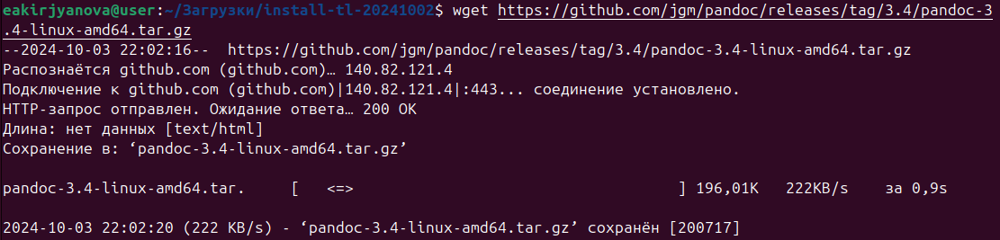

---
## Front matter
title: "Отчёт по лабораторной работе №3"
subtitle: "Дисциплина: Архитектура компьютера"
author: "Кирьянова Екатерина Андреевна"

## Generic otions
lang: ru-RU
toc-title: "Содержание"

## Bibliography
bibliography: bib/cite.bib
csl: pandoc/csl/gost-r-7-0-5-2008-numeric.csl

## Pdf output format
toc: true # Table of contents
toc-depth: 2
lof: true # List of figures
fontsize: 12pt
linestretch: 1.5
papersize: a4
documentclass: scrreprt
## I18n polyglossia
polyglossia-lang:
  name: russian
  options:
	- spelling=modern
	- babelshorthands=true
polyglossia-otherlangs:
  name: english
## I18n babel
babel-lang: russian
babel-otherlangs: english
## Fonts
mainfont: IBM Plex Serif
romanfont: IBM Plex Serif
sansfont: IBM Plex Sans
monofont: IBM Plex Mono
mathfont: STIX Two Math
mainfontoptions: Ligatures=Common,Ligatures=TeX,Scale=0.94
romanfontoptions: Ligatures=Common,Ligatures=TeX,Scale=0.94
sansfontoptions: Ligatures=Common,Ligatures=TeX,Scale=MatchLowercase,Scale=0.94
monofontoptions: Scale=MatchLowercase,Scale=0.94,FakeStretch=0.9
mathfontoptions:
## Biblatex
biblatex: true
biblio-style: "gost-numeric"
biblatexoptions:
  - parentracker=true
  - backend=biber
  - hyperref=auto
  - language=auto
  - autolang=other*
  - citestyle=gost-numeric
## Pandoc-crossref LaTeX customization
figureTitle: "Рис."
tableTitle: "Таблица"
listingTitle: "Листинг"
lofTitle: "Список иллюстраций"
lolTitle: "Листинги"
## Misc options
indent: true
header-includes:
  - \usepackage{indentfirst}
  - \usepackage{float} # keep figures where there are in the text
  - \floatplacement{figure}{H} # keep figures where there are in the text
---

# Цель работы

Освоить оформление отчетов с помощью легковесного языка разметки Markdown.

# Задание

1. Установить необходимое ПО
2. Составить отчет по лабораторной работе №3 с помощью языка разметки Markdown.
3. Выполнить задание для самостоятельной работы

# Теоретическое введение

Markdown - это легковесный язык разметки, с помощью которого можно оформлять тексты
различными способами, не используя Word или другие текстовые редакторы. Можно использовать различные шрифты, указывать ссылки, вставлять изображения, составлять списки и компилировать файлы формата docx и pdf.

# Выполнение лабораторной работы

## Установка необходимого ПО.

Установила TexLive с официального сайта (рис.[-@fig:001]).
    
{#fig:001 width=90%} 

Установила Pandoc (рис.[-@fig:002]).
    
{ #fig:002 width=90% } 

Установила Pandoc-crossref (рис. [-@fig:003]).
    
{ #fig:003 width=90% }

Скопировала файлы pandoc и pandoc-crossref в нужный каталог для корректной работы (рис.[-@fig:004]).
    
{#fig:004 width=90%}

## Составление отчета по выполнению лабораторной работы №3 с помощью Markdown

Перехожу в рабочий каталог с помощью команды cd и ввожу команду make для компиляции шаблона с использованием Markdown и генерации файлов формата docx и pdf (рис.[-@fig:005])
    
{#fig:005 width=90%}

Проверяю корректность выполнения с помощью команды ls (рис.[-@fig:006])

{#fig:006 width=90%}

Открываю файл report.md с помощью текстового редактора gedit (рис.[-@fig:007])

{#fig:007 width=90%}

# Выводы

В ходе выполнения данной лабораторной работы я научилась оформлять отчеты с помощью легковесного языка разметки Markdown.

# Список литературы
1. [Архитектура ЭВМ](https://esystem.rudn.ru/pluginfile.php/2089530/mod_resource/content/0/Лабораторная%20работа%20№3.%20Язык%20разметки%20.pdf)

