---
## Front matter
title: "Отчёт по лабораторной работе №4"
subtitle: "Дисциплина: Архитектура компьютера"
author: "Кирьянова Екатерина Андреевна"

## Generic otions
lang: ru-RU
toc-title: "Содержание"

## Bibliography
bibliography: bib/cite.bib
csl: pandoc/csl/gost-r-7-0-5-2008-numeric.csl

## Pdf output format
toc: true # Table of contents
toc-depth: 2
lof: true # List of figures
fontsize: 12pt
linestretch: 1.5
papersize: a4
documentclass: scrreprt
## I18n polyglossia
polyglossia-lang:
  name: russian
  options:
	- spelling=modern
	- babelshorthands=true
polyglossia-otherlangs:
  name: english
## I18n babel
babel-lang: russian
babel-otherlangs: english
## Fonts
mainfont: IBM Plex Serif
romanfont: IBM Plex Serif
sansfont: IBM Plex Sans
monofont: IBM Plex Mono
mathfont: STIX Two Math
mainfontoptions: Ligatures=Common,Ligatures=TeX,Scale=0.94
romanfontoptions: Ligatures=Common,Ligatures=TeX,Scale=0.94
sansfontoptions: Ligatures=Common,Ligatures=TeX,Scale=MatchLowercase,Scale=0.94
monofontoptions: Scale=MatchLowercase,Scale=0.94,FakeStretch=0.9
mathfontoptions:
## Biblatex
biblatex: true
biblio-style: "gost-numeric"
biblatexoptions:
  - parentracker=true
  - backend=biber
  - hyperref=auto
  - language=auto
  - autolang=other*
  - citestyle=gost-numeric
## Pandoc-crossref LaTeX customization
figureTitle: "Рис."
tableTitle: "Таблица"
listingTitle: "Листинг"
lofTitle: "Список иллюстраций"
lotTitle: "Список таблиц"
lolTitle: "Листинги"
## Misc options
indent: true
header-includes:
  - \usepackage{indentfirst}
  - \usepackage{float} # keep figures where there are in the text
  - \floatplacement{figure}{H} # keep figures where there are in the text
---

# Цель работы

Освоить процедуру компиляции и сборки программ, написанных на ассемблере NASM.

# Задание

1. Выполнить программу "Hello world!"
2. Использовать транслятор NASM
3. Использовать расширенный синтаксис командной строки NASM
4. Использовать компоновщик LD
5. Запустить исполняемый файл
6. Выполнить задание для самостоятельной работы

# Теоретическое введение

Основными функциональными элементами любой электронно-вычислительной машины
(ЭВМ) являются центральный процессор, память и периферийные устройства (рис. 4.1).
Взаимодействие этих устройств осуществляется через общую шину, к которой они подклю-
чены. Физически шина представляет собой большое количество проводников, соединяющих
устройства друг с другом. В современных компьютерах проводники выполнены в виде элек-
тропроводящих дорожек на материнской (системной) плате.
Основной задачей процессора является обработка информации, а также организация
координации всех узлов компьютера. В состав центрального процессора (ЦП) входят
следующие устройства:
• арифметико-логическое устройство (АЛУ) — выполняет логические и арифметиче-
ские действия, необходимые для обработки информации, хранящейся в памяти;
• устройство управления (УУ) — обеспечивает управление и контроль всех устройств
компьютера;
• регистры — сверхбыстрая оперативная память небольшого объёма, входящая в со-
став процессора, для временного хранения промежуточных результатов выполнения
инструкций; регистры процессора делятся на два типа: регистры общего назначения и
специальные регистры.
Для того, чтобы писать программы на ассемблере, необходимо знать, какие регистры
процессора существуют и как их можно использовать. Большинство команд в программах
написанных на ассемблере используют регистры в качестве операндов. Практически все
команды представляют собой преобразование данных хранящихся в регистрах процессора,
это например пересылка данных между регистрами или между регистрами и памятью, пре-
образование (арифметические или логические операции) данных хранящихся в регистрах.
Доступ к регистрам осуществляется не по адресам, как к основной памяти, а по именам.
Каждый регистр процессора архитектуры x86 имеет свое название, состоящее из 2 или 3
букв латинского алфавита.
В качестве примера приведем названия основных регистров общего назначения (именно
эти регистры чаще всего используются при написании программ):
• RAX, RCX, RDX, RBX, RSI, RDI — 64-битные
• EAX, ECX, EDX, EBX, ESI, EDI — 32-битные
• AX, CX, DX, BX, SI, DI — 16-битные
• AH, AL, CH, CL, DH, DL, BH, BL — 8-битные (половинки 16-битных регистров). Например,
AH (high AX) — старшие 8 бит регистра AX, AL (low AX) — младшие 8 бит регистра AX.
Другим важным узлом ЭВМ является оперативное запоминающее устройство (ОЗУ).
ОЗУ — это быстродействующее энергозависимое запоминающее устройство, которое на-
прямую взаимодействует с узлами процессора, предназначенное для хранения программ и
данных, с которыми процессор непосредственно работает в текущий момент. ОЗУ состоит из
одинаковых пронумерованных ячеек памяти. Номер ячейки памяти — это адрес хранящихся
в ней данных.
Язык ассемблера (assembly language, сокращённо asm) — машинно-ориентированный
язык низкого уровня. Можно считать, что он больше любых других языков приближен к
архитектуре ЭВМ и её аппаратным возможностям, что позволяет получить к ним более
полный доступ, нежели в языках высокого уровня, таких как C/C++, Perl, Python и пр.

# Выполнение лабораторной работы

## Выполнение программы Hello world!

Для работы с программами на языке ассемблера создаю новый каталог и перехожу в него (рис.[-@fig:001]).

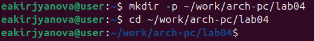{#fig:001 width=90%}

Создаю текстовый файл с названием hello.asm и открываю его с помощью текстового редактора gedit (рис.[-@fig:002]).

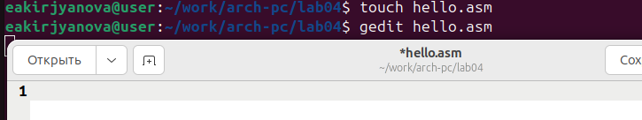{#fig:002 width=90%}

Ввожу в созданный файл текст программы для вывода Hello world! (рис.[-@fig:003]).

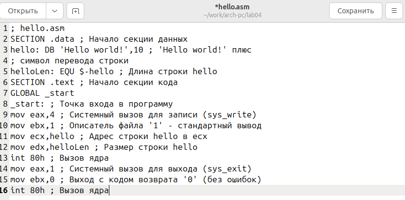{#fig:003 width=90%}

## Использование транслятора NASM

С помощью NASM превращаю текст программы в объектный код и проверяю успешность выполнения (рис.[-@fig:004]).

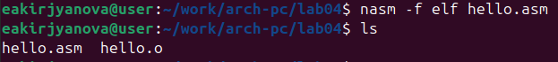{#fig:004 width=90%}

## Использование расширенного синтаксиса командной строки NASM

Использую команду, которая скомпилирует исходный файл в obj.o, и проверяю успешность выполнения (рис.[-@fig:005]).

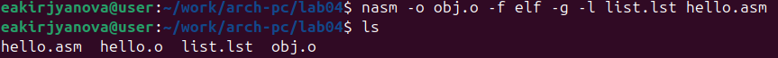{#fig:005 width=90%}

## Использование компоновщика LD

Передаю объектный файл на обработку компоновщику и проверяю успешность выполнения (рис.[-@fig:006]).

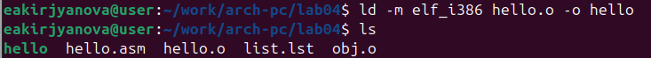{#fig:006 width=90%}

Задаю исполняемому файлу имя main, так как после ключа -o идет значение main. Объектный файл, из которого собран исполняемый файл, имеет имя obj.o (рис.[-@fig:007]).

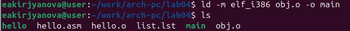{#fig:007 width=90%}

## Запуск исполняемого файла

Запускаю на выполнение созданный исполняемый файл (рис.[-@fig:008]).

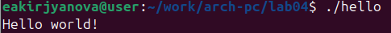{#fig:008 width=90%}

## Задание для самостоятельной работы

Создаю копию файла hello.asm с именем lab4.asm и открываю ее с помощью текстового редактора gedit (рис.[-@fig:009]).

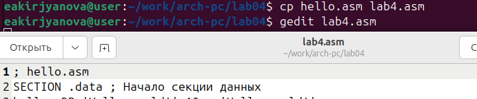{#fig:009 width=90%}

Редактирую текст программы для того, чтобы вывести свое имя (рис.[-@fig:010]).

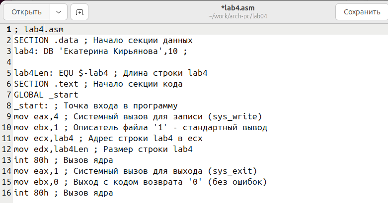{#fig:010 width=90%}

Транслирую полученный текст программы в объектный файл и проверяю успешность выполнения (рис.[-@fig:011]).

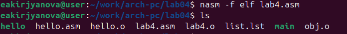{#fig:011 width=90%}

Передаю объектный файл компоновщику LD (рис.[-@fig:012]).

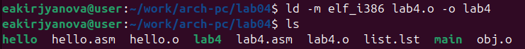{#fig:012 width=90%}

Запускаю исполняемый файл (рис.[-@fig:013]).

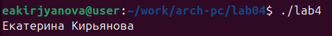{#fig:013 width=90%}

Копирую файлы hello.asm и lab4.asm в свой локальный репозиторий (рис.[-@fig:014]).

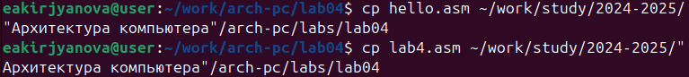{#fig:014 width=90%}

Добавляю файлы на GitHub (рис.[-@fig:015]).

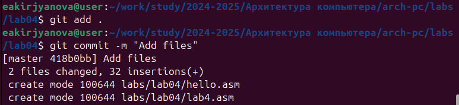{#fig:015 width=90%}

Отправляю файлы на сервер с помощью git push (рис.[-@fig:016]).

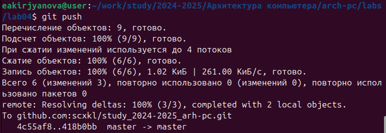{#fig:016 width=90%}

Проверяю успешность выполнения (рис.[-@fig:017]).

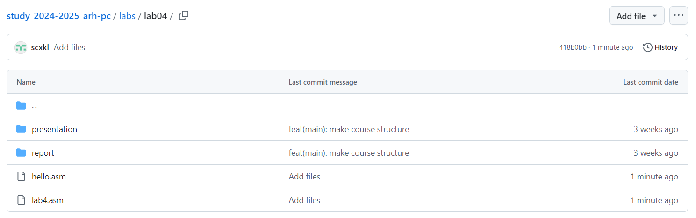{#fig:017 width=90%}

# Выводы

В ходе выполнения данной лабораторной работы я освоила процедуры компиляции и сборки программ, написанных на ассемблере NASM.

# Список литературы{.unnumbered}

1. [Архитектура ЭВМ](https://esystem.rudn.ru/pluginfile.php/2089533/mod_resource/content/0/%D0%9B%D0%B0%D0%B1%D0%BE%D1%80%D0%B0%D1%82%D0%BE%D1%80%D0%BD%D0%B0%D1%8F%20%D1%80%D0%B0%D0%B1%D0%BE%D1%82%D0%B0%20%E2%84%964.%20%D0%A1%D0%BE%D0%B7%D0%B4%D0%B0%D0%BD%D0%B8%D0%B5%20%D0%B8%20%D0%BF%D1%80%D0%BE%D1%86%D0%B5%D1%81%D1%81%20%D0%BE%D0%B1%D1%80%D0%B0%D0%B1%D0%BE%D1%82%D0%BA%D0%B8%20%D0%BF%D1%80%D0%BE%D0%B3%D1%80%D0%B0%D0%BC%D0%BC%20%D0%BD%D0%B0%20%D1%8F%D0%B7%D1%8B%D0%BA%D0%B5%20%D0%B0%D1%81%D1%81%D0%B5%D0%BC%D0%B1%D0%BB%D0%B5%D1%80%D0%B0%20NASM.pdf)
