---
## Front matter
title: "Отчёт по лабораторной работе №5"
subtitle: "Дисциплина: Архитектура компьютера"
author: "Кирьянова Екатерина Андреевна"

## Generic otions
lang: ru-RU
toc-title: "Содержание"

## Bibliography
bibliography: bib/cite.bib
csl: pandoc/csl/gost-r-7-0-5-2008-numeric.csl

## Pdf output format
toc: true # Table of contents
toc-depth: 2
lof: true # List of figures
fontsize: 12pt
linestretch: 1.5
papersize: a4
documentclass: scrreprt
## I18n polyglossia
polyglossia-lang:
  name: russian
  options:
	- spelling=modern
	- babelshorthands=true
polyglossia-otherlangs:
  name: english
## I18n babel
babel-lang: russian
babel-otherlangs: english
## Fonts
mainfont: IBM Plex Serif
romanfont: IBM Plex Serif
sansfont: IBM Plex Sans
monofont: IBM Plex Mono
mathfont: STIX Two Math
mainfontoptions: Ligatures=Common,Ligatures=TeX,Scale=0.94
romanfontoptions: Ligatures=Common,Ligatures=TeX,Scale=0.94
sansfontoptions: Ligatures=Common,Ligatures=TeX,Scale=MatchLowercase,Scale=0.94
monofontoptions: Scale=MatchLowercase,Scale=0.94,FakeStretch=0.9
mathfontoptions:
## Biblatex
biblatex: true
biblio-style: "gost-numeric"
biblatexoptions:
  - parentracker=true
  - backend=biber
  - hyperref=auto
  - language=auto
  - autolang=other*
  - citestyle=gost-numeric
## Pandoc-crossref LaTeX customization
figureTitle: "Рис."
listingTitle: "Листинг"
lofTitle: "Список иллюстраций"
lolTitle: "Листинги"
## Misc options
indent: true
header-includes:
  - \usepackage{indentfirst}
  - \usepackage{float} # keep figures where there are in the text
  - \floatplacement{figure}{H} # keep figures where there are in the text
---

# Цель работы

Приобрести практические навыки работы в Midnight Commander и освоить инструкции языка ассемблера mov и int.

# Задание

1. Основы работы с mc
2. Структура программы на языке ассемблера NASM
3. Подключение внешнего файла
4. Выполнение заданий для самостоятельной работы

# Теоретическое введение

Midnight Commander (или просто mc) — это программа, которая позволяет просматривать структуру каталогов и выполнять основные операции по управлению файловой системой, т.е. mc является файловым менеджером. Midnight Commander позволяет сделать работу с файлами более удобной и наглядной.
Программа на языке ассемблера NASM, как правило, состоит из трёх секций: секция кода программы (SECTION .text), секция инициированных (известных во время компиляции) данных (SECTION .data) и секция неинициализированных данных (тех, под которые во время компиляции только отводится память, а значение присваивается в ходе выполнения программы) (SECTION .bss).
Для объявления инициированных данных в секции .data используются директивы DB, DW, DD, DQ и DT, которые резервируют память и указывают, какие значения должны храниться в этой памяти:
- DB (define byte) — определяет переменную размером в 1 байт;
- DW (define word) — определяет переменную размеров в 2 байта (слово);
- DD (define double word) — определяет переменную размером в 4 байта (двойное слово);
- DQ (define quad word) — определяет переменную размером в 8 байт (учетве-
рённое слово);
- DT (define ten bytes) — определяет переменную размером в 10 байт. Директивы используются для объявления простых переменных и для объявления массивов. Для определения строк принято использовать директиву DB в связи с особенностями хранения данных в оперативной памяти.
Инструкция языка ассемблера mov предназначена для дублирования данных источника в приёмнике. 
```NASM
mov dst,src
```
Здесь операнд dst — приёмник, а src — источник.
В качестве операнда могут выступать регистры (register), ячейки памяти (memory) и непосредственные значения (const).
Инструкция языка ассемблера intпредназначена для вызова прерывания с
указанным номером. 
```NASM
int n
```
Здесь n — номер прерывания, принадлежащий диапазону 0–255. При программировании в Linux с использованием вызовов ядра sys_calls n=80h (принято задавать в шестнадцатеричной системе счисления).

# Выполнение лабораторной работы
## Основы работы с Midnight Commander

Открываю Midnight Commander и перехожу в нужный каталог (рис. [-@fig:001]).

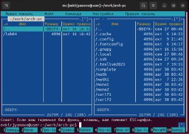{ #fig:001 width=70% }

Создаю новый каталог с помощью клавиши F7 и перехожу в него (рис. [-@fig:002])

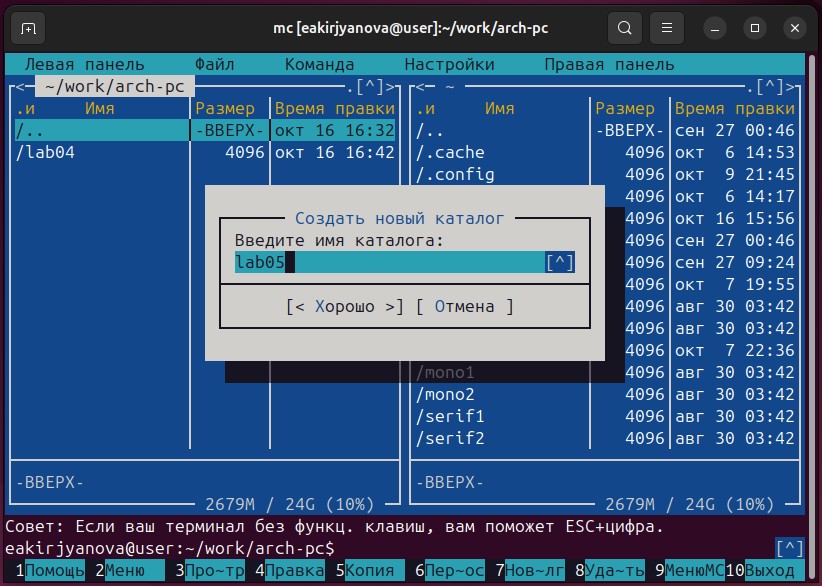{ #fig:002 width=70% }

Создаю новый файл lab5-1.asm (рис. [-@fig:003]).

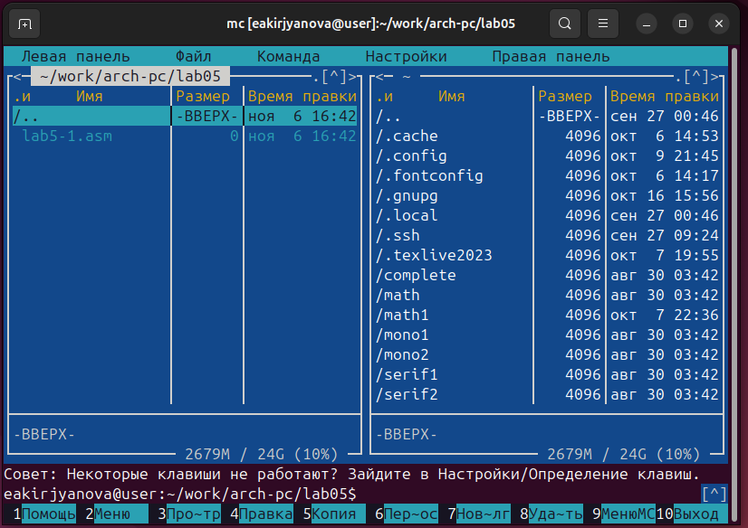{ #fig:003 width=70% }

## Cтруктура программы на языке ассемблера NASM

Открываю файл в текстовом редакторе nano (рис. [-@fig:004]).

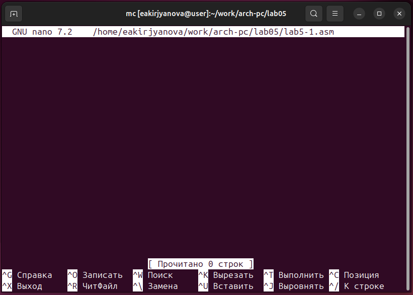{ #fig:004 width=70% }

Ввожу текст программы из листинга 5.1 (рис. [-@fig:005]).

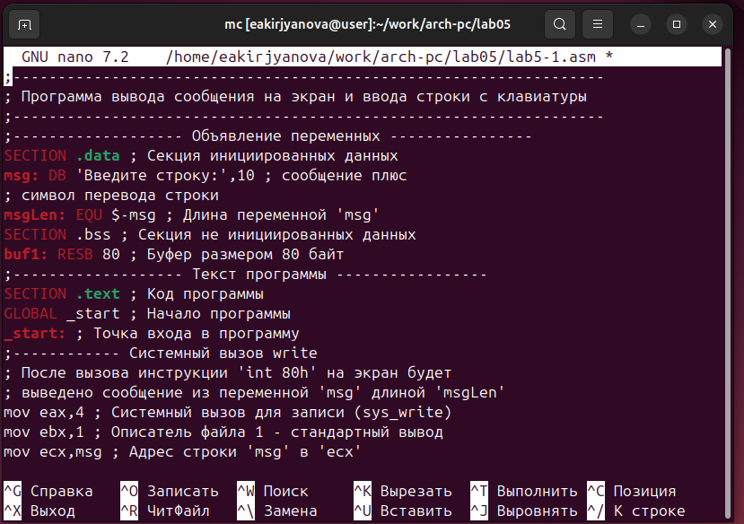{ #fig:005 width=70% }

Выхожу из файла с помощью клавиш Ctrl+X и сохраняю с помощью клавиш Y, Enter. Далее открываю файл клавишей F3 и проверяю успешность выполнения (рис. [-@fig:006]).

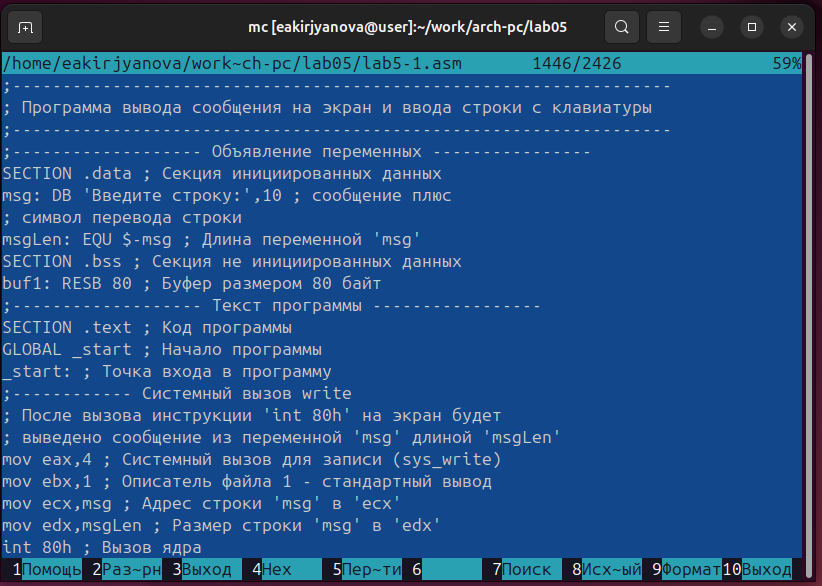{ #fig:006 width=70% }

Транслирую текст программы в объектный файл, выполняю компоновку объектного файла и запускаю исполняемый файл. После строки "Введите строку:" ввожу ФИО (рис. [-@fig:007]). 

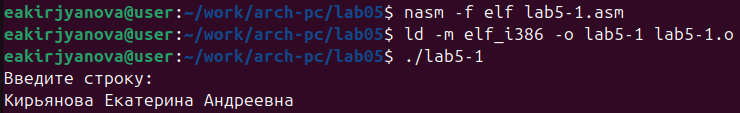{ #fig:007 width=70% }

## Подключение внешнего файла

Открываю две панели (рис. [-@fig:008]).

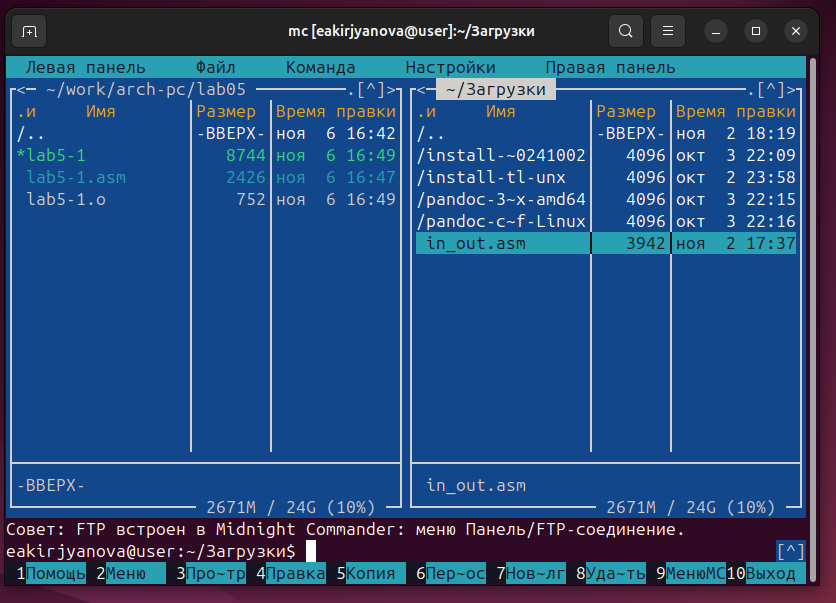{ #fig:008 width=70% }

Копирую внешний файл в нужный каталог с помощью клавиши F5 (рис. [-@fig:009]). 

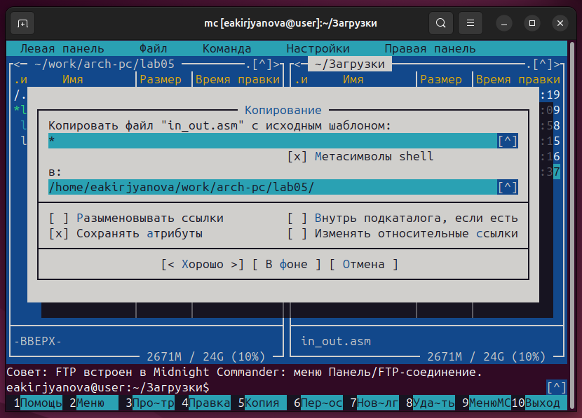{ #fig:009 width=70% }

Копирование прошло успешно (рис. [-@fig:010]).

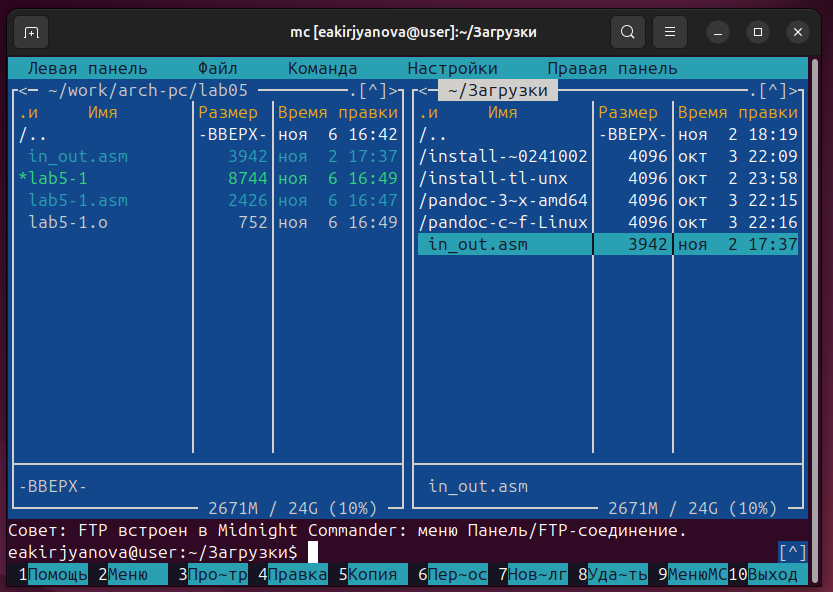{ #fig:010 width=70% }

Создаю копию файла lab5-1.asm с именем lab5-2.asm с помощью клавиши F5 (рис. [-@fig:011]).

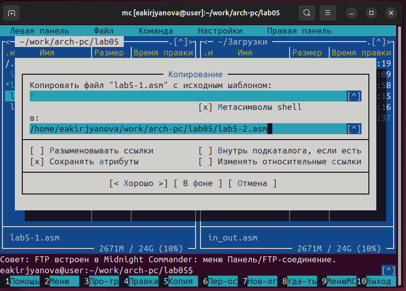{ #fig:011 width=70% }

Демонстрирую успешность выполнения (рис. [-@fig:012]).

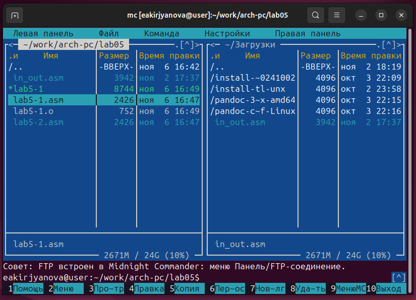{ #fig:012 width=70% }

Редактирую файл согласно листингу 5.2 (рис. [-@fig:013]).

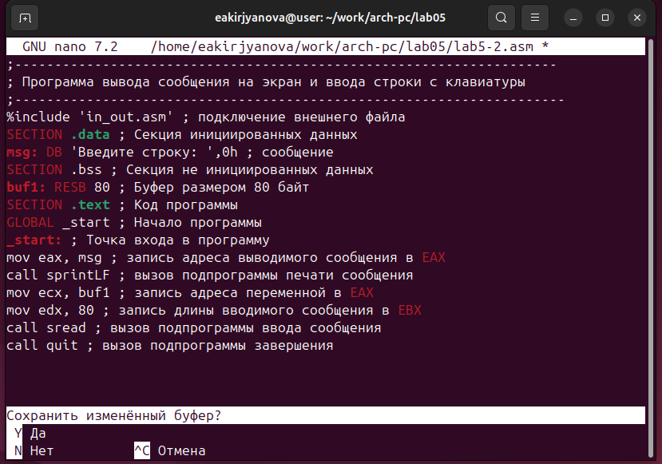{ #fig:013 width=70% }

Транслирую текст программы в объектный файл, выполняю компоновку объектного файла и запускаю исполняемый файл (рис. [-@fig:014]).

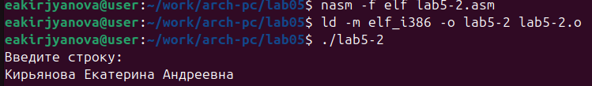{ #fig:014 width=70% }

Создаю файл lab5-22.asm на основе файла lab5-2.asm и меняю sprintLF на sprint (рис. [-@fig:015]). 

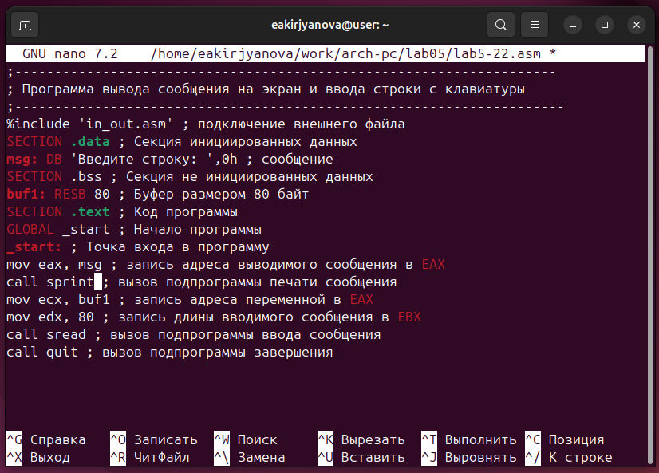{ #fig:015 width=70% }

Снова транслирую в объектный файл, выполняю его компоновку и запускаю (рис. [-@fig:016]).

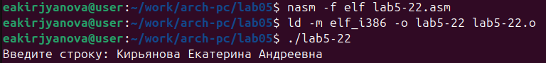{ #fig:016 width=70% }

Разница между первым исполняемым файлом lab5-2 и вторым lab5-22 в том, что запуск первого запрашивает ввод с новой строки, а программа, которая исполняется при запуске второго, запрашивает ввод без переноса на новую строку, потому что в этом заключается различие между подпрограммами sprintLF и sprint.

## Задание для самостоятельной работы

Создаю копию файла lab5-1.asm с именем lab5-11.asm с помощью  клавиши F5 (рис. [-@fig:017]).

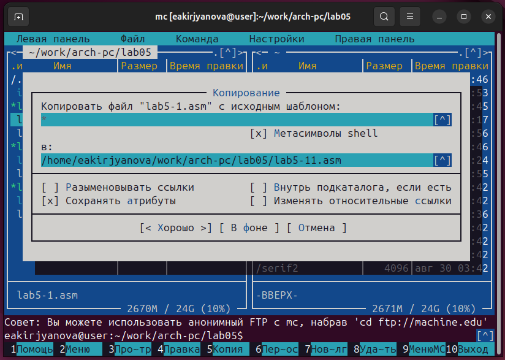{ #fig:017 width=70% }

Изменяю программу, чтобы кроме запроса ввода она выводила заданную строку (рис. [-@fig:018]). 

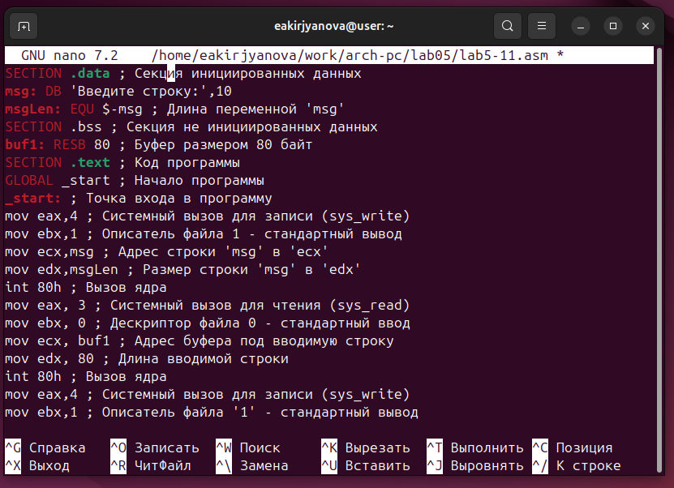{ #fig:018 width=70% }

Транслирую текст программы в объектный файл, выполняю компоновку объектного файла и запускаю исполняемый файл. Программа выводит заданную мною строку (рис. [-@fig:019]).
 
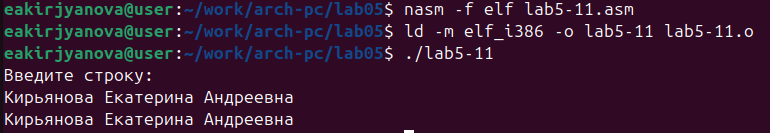{ #fig:019 width=70% }

Код программы из пункта 1:

```NASM
SECTION .data ; Секция инициированных данных
msg: DB 'Введите строку:',10
msgLen: EQU $-msg ; Длина переменной 'msg'
SECTION .bss ; Секция не инициированных данных
buf1: RESB 80 ; Буфер размером 80 байт
SECTION .text ; Код программы
GLOBAL _start ; Начало программы
_start: ; Точка входа в программу
mov eax,4 ; Системный вызов для записи (sys_write)
mov ebx,1 ; Описатель файла 1 - стандартный вывод
mov ecx,msg ; Адрес строки 'msg' в 'ecx'
mov edx,msgLen ; Размер строки 'msg' в 'edx'
int 80h ; Вызов ядра
mov eax, 3 ; Системный вызов для чтения (sys_read)
mov ebx, 0 ; Дескриптор файла 0 - стандартный ввод
mov ecx, buf1 ; Адрес буфера под вводимую строку
mov edx, 80 ; Длина вводимой строки
int 80h ; Вызов ядра
mov eax,4 ; Системный вызов для записи (sys_write)
mov ebx,1 ; Описатель файла '1' - стандартный вывод
mov ecx,buf1 ; Адрес строки buf1 в ecx
mov edx,buf1 ; Размер строки buf1
int 80h ; Вызов ядра
mov eax,1 ; Системный вызов для выхода (sys_exit)
mov ebx,0 ; Выход с кодом возврата 0 (без ошибок)
int 80h ; Вызов ядра
```

Создаю копию файла lab5-2.asm с именем lab5-222.asm с помощью клавиши F5 (рис. [-@fig:020]).

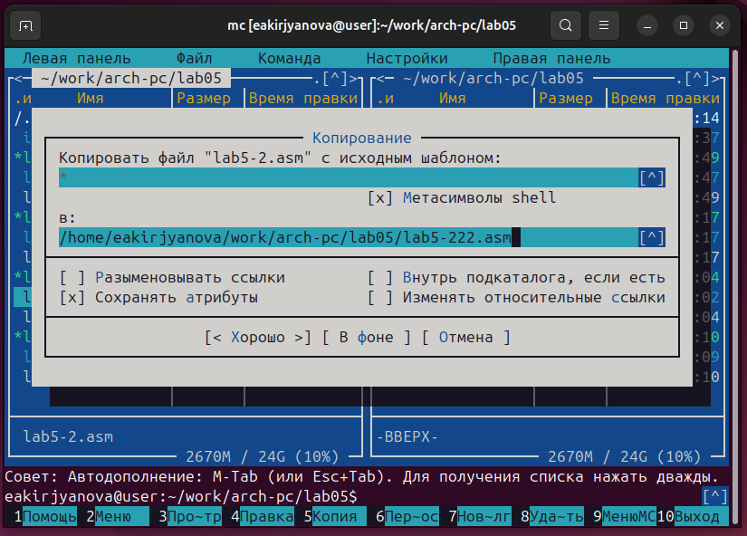{ #fig:020 width=70% }

Изменяю программу, чтобы кроме запроса ввода она выводила заданную строку (рис. [-@fig:021]). 

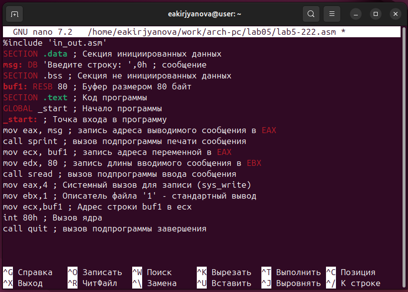{ #fig:021 width=70% }

Транслирую текст программы в объектный файл, выполняю компоновку объектного файла и запускаю исполняемый файл. Программа выводит заданную мною строку (рис. [-@fig:022]).

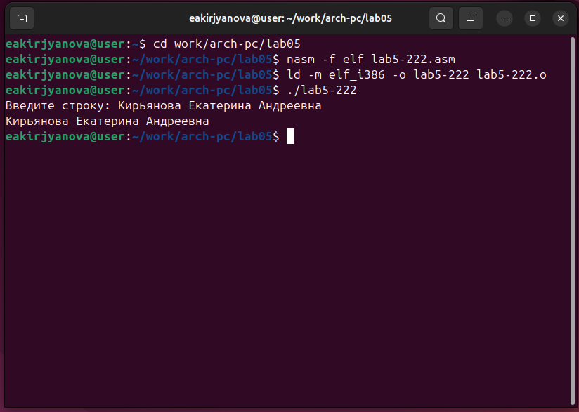{ #fig:022 width=70% }

Код программы из пункта 2:

```NASM
%include 'in_out.asm'
SECTION .data ; Секция инициированных данных
msg: DB 'Введите строку: ',0h ; сообщение
SECTION .bss ; Секция не инициированных данных
buf1: RESB 80 ; Буфер размером 80 байт
SECTION .text ; Код программы
GLOBAL _start ; Начало программы
_start: ; Точка входа в программу
mov eax, msg ; запись адреса выводимого сообщения в `EAX`
call sprint ; вызов подпрограммы печати сообщения
mov ecx, buf1 ; запись адреса переменной в `EAX`
mov edx, 80 ; запись длины вводимого сообщения в `EBX`
call sread ; вызов подпрограммы ввода сообщения
mov eax,4 ; Системный вызов для записи (sys_write)
mov ebx,1 ; Описатель файла '1' - стандартный вывод
mov ecx,buf1 ; Адрес строки buf1 в ecx
int 80h ; Вызов ядра
call quit ; вызов подпрограммы завершения
```

# Выводы

В ходе выполнения данной лабораторной работы я приобрела практические навыки работы в Midnight Commander и освоила инструкции языка ассемблера mov и int. 

# Список литературы

1. [Лабораторная работа №5](https://esystem.rudn.ru/pluginfile.php/2089538/mod_resource/content/0/%D0%9B%D0%B0%D0%B1%D0%BE%D1%80%D0%B0%D1%82%D0%BE%D1%80%D0%BD%D0%B0%D1%8F%20%D1%80%D0%B0%D0%B1%D0%BE%D1%82%D0%B0%20%E2%84%965.%20%D0%9E%D1%81%D0%BD%D0%BE%D0%B2%D1%8B%20%D1%80%D0%B0%D0%B1%D0%BE%D1%82%D1%8B%20%D1%81%20Midnight%20Commander%20%28%29.%20%D0%A1%D1%82%D1%80%D1%83%D0%BA%D1%82%D1%83%D1%80%D0%B0%20%D0%BF%D1%80%D0%BE%D0%B3%D1%80%D0%B0%D0%BC%D0%BC%D1%8B%20%D0%BD%D0%B0%20%D1%8F%D0%B7%D1%8B%D0%BA%D0%B5%20%D0%B0%D1%81%D1%81%D0%B5%D0%BC%D0%B1%D0%BB%D0%B5%D1%80%D0%B0%20NASM.%20%D0%A1%D0%B8%D1%81%D1%82%D0%B5%D0%BC%D0%BD%D1%8B%D0%B5%20%D0%B2%D1%8B%D0%B7%D0%BE%D0%B2%D1%8B%20%D0%B2%20%D0%9E%D0%A1%20GNU%20Linux.pdf)
