---
## Front matter
title: "Отчёт по лабораторной работе №6"
subtitle: "Дисциплина: Архитектура компьютера"
author: "Кирьянова Екатерина Андреевна"

## Generic otions
lang: ru-RU
toc-title: "Содержание"

## Bibliography
bibliography: bib/cite.bib
csl: pandoc/csl/gost-r-7-0-5-2008-numeric.csl

## Pdf output format
toc: true # Table of contents
toc-depth: 2
lof: true # List of figures
fontsize: 12pt
linestretch: 1.5
papersize: a4
documentclass: scrreprt
## I18n polyglossia
polyglossia-lang:
  name: russian
  options:
	- spelling=modern
	- babelshorthands=true
polyglossia-otherlangs:
  name: english
## I18n babel
babel-lang: russian
babel-otherlangs: english
## Fonts
mainfont: IBM Plex Serif
romanfont: IBM Plex Serif
sansfont: IBM Plex Sans
monofont: IBM Plex Mono
mathfont: STIX Two Math
mainfontoptions: Ligatures=Common,Ligatures=TeX,Scale=0.94
romanfontoptions: Ligatures=Common,Ligatures=TeX,Scale=0.94
sansfontoptions: Ligatures=Common,Ligatures=TeX,Scale=MatchLowercase,Scale=0.94
monofontoptions: Scale=MatchLowercase,Scale=0.94,FakeStretch=0.9
mathfontoptions:
## Biblatex
biblatex: true
biblio-style: "gost-numeric"
biblatexoptions:
  - parentracker=true
  - backend=biber
  - hyperref=auto
  - language=auto
  - autolang=other*
  - citestyle=gost-numeric
## Pandoc-crossref LaTeX customization
figureTitle: "Рис."
listingTitle: "Листинг"
lofTitle: "Список иллюстраций"
lolTitle: "Листинги"
## Misc options
indent: true
header-includes:
  - \usepackage{indentfirst}
  - \usepackage{float} # keep figures where there are in the text
  - \floatplacement{figure}{H} # keep figures where there are in the text
---

# Цель работы

Освоить арифметические инструкции языка ассемблера NASM.

# Задание

1. Символьные и численные данные в NASM
2. Выполнение арифметических операций в NASM
3. Задание для самостоятельной работы

# Теоретическое введение

Большинство инструкций на языке ассемблера требуют обработки операндов. Адрес операнда предоставляет место, где хранятся данные, подлежащие обработке. Это могут быть данные хранящиеся в регистре или в ячейке памяти.

Регистровая адресация – операнды хранятся в регистрах и в команде используются имена этих регистров, например: mov ax,bx.
Непосредственная адресация – значение операнда задается непосредственно в команде, Например: mov ax,2.
Адресация памяти – операнд задает адрес в памяти. В команде указывается символическое обозначение ячейки памяти, над содержимым которой требуется выполнить операцию.

Ввод информации с клавиатуры и вывод её на экран осуществляется в символьном виде. Кодирование этой информации производится согласно кодовой таблице символов ASCII. ASCII – сокращение от American Standard Code for Information Interchange (Американский стандартный код для обмена информацией). Согласно стандарту ASCII каждый символ кодируется одним байтом. Среди инструкций NASM нет такой, которая выводит числа (не в символьном виде). Поэтому, например, чтобы вывести число, надо предварительно преобразовать его цифры в ASCII-коды этих цифр и выводить на экран эти коды, а не само число. Если же выводить число на экран непосредственно, то экран воспримет его не как число, а как последовательность ASCII-символов – каждый байт числа будет воспринят как один ASCII-символ – и выведет на экран эти символы. Аналогичная ситуация происходит и при вводе данных с клавиатуры. Введенные данные будут представлять собой символы, что сделает невозможным получение корректного результата при выполнении над ними арифметических операций. Для решения этой проблемы необходимо проводить преобразование ASCII символов в числа и обратно.

# Выполнение лабораторной работы
## Символьные и численные данные в NASM

Создаю новый каталог и файл в нем (рис. [-@fig:001]).

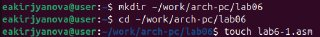{ #fig:001 width=70% }

Ввожу текст программы из листинга 6.1 (рис. [-@fig:002])

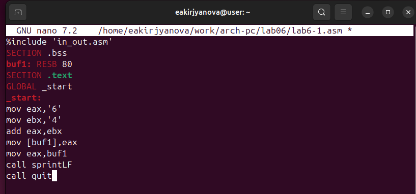{ #fig:002 width=70% }

Создаю исполняемый файл и запускаю его (рис. [-@fig:003]).

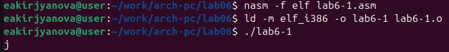{ #fig:003 width=70% }

Редактирую текст программы (рис. [-@fig:004]).

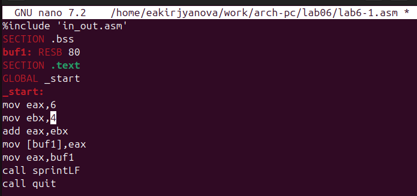{ #fig:004 width=70% }

Создаю обновленный исполняемый файл и запускаю его (рис. [-@fig:005]).

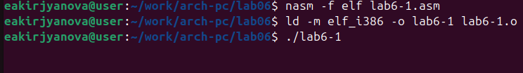{ #fig:005 width=70% }

Создаю новый файл (рис. [-@fig:006]).

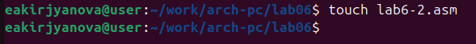{ #fig:006 width=70% }

Ввожу текст программы из листинга 6.2 (рис. [-@fig:007]). 

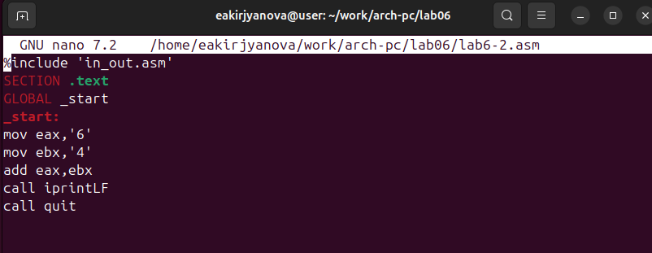{ #fig:007 width=70% }

Создаю исполняемый файл и запускаю его (рис. [-@fig:008]).

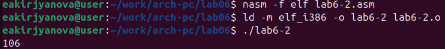{ #fig:008 width=70% }

Аналогично предыдущему меняю символы на числа (рис. [-@fig:009]). 

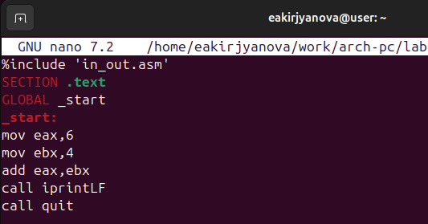{ #fig:009 width=70% }

Создаю исполняемый файл и запускаю его (рис. [-@fig:010]).

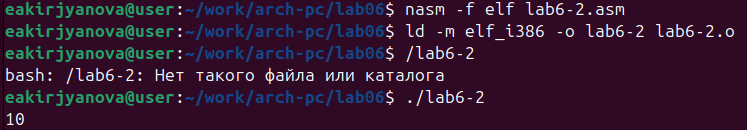{ #fig:010 width=70% }

Меняю iprintLF на iprint(рис. [-@fig:011]).

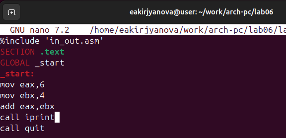{ #fig:011 width=70% }

Создаю исполняемый файл и запускаю его (рис. [-@fig:012]).

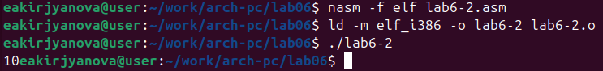{ #fig:012 width=70% }

Вывод изменился, так как iprintLF переносит строку, а iprint нет.

## Выполнение арифметических операций в NASM 

Создаю новый файл (рис. [-@fig:013]).

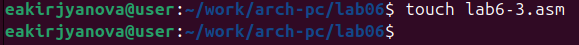{ #fig:013 width=70% }

Ввожу текст программы из листинга 6.3 (рис. [-@fig:014]).

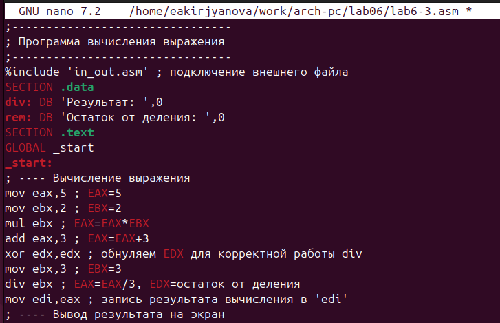{ #fig:014 width=70% }

Создаю исполняемый файл и запускаю его (рис. [-@fig:015]). 

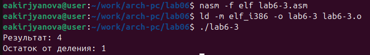{ #fig:015 width=70% }

Редактирую (рис. [-@fig:016]).

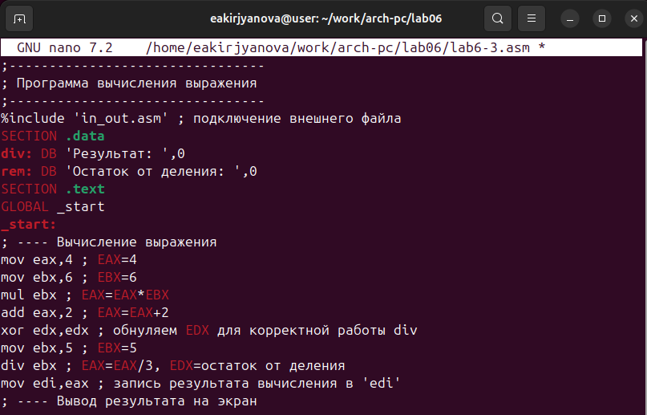{ #fig:016 width=70% }

Создаю исполняемый файл и запускаю (рис. [-@fig:017]).

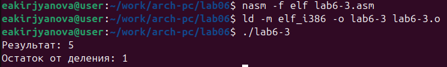{ #fig:017 width=70% }

Создаю новый файл (рис. [-@fig:018]). 

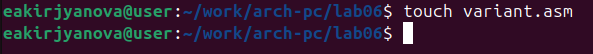{ #fig:018 width=70% }

Ввожу текст программы из листинга 6.4 (рис. [-@fig:019]).
 
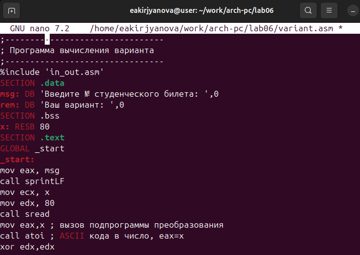{ #fig:019 width=70% }

Создаю исполняемый файл и запускаю его (рис. [-@fig:020]).

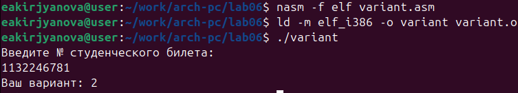{ #fig:020 width=70% }

Ответы на вопросы:
1. mov eax,rem ; call sprint
2. Инструкция mov ecx, x используется, чтобы положить адрес вводимой строки x в регистр ecx mov edx, 80 - запись в регистр edx длины вводимой строки call sread - вызов подпрограммы из внешнего файла, обеспечивающей ввод сообщения с клавиатуры

3. call atoi используется для вызова подпрограммы из внешнего файла, которая преобразует ascii-код символа в целое число и записывает результат в регистр eax

4. xor edx,edx ; обнуление edx для корректной работы div
mov ebx,20 ; ebx = 20
div ebx ; eax = eax/20, edx - остаток от деления
inc edx ; edx = edx + 1

5. При выполнении инструкции div ebx остаток от деления записывается в регистр edx

6. inc edx увеличивает значение регистра edx на 1

7. mov eax,edx
   call iprintLF

## Задание для самостоятельной работы

Создаю файл (рис. [-@fig:021]). 

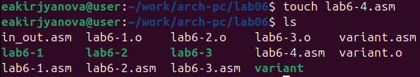{ #fig:021 width=70% }

Ввожу текст программы для вычисления выражения под 2 вариантом (рис. [-@fig:022]).

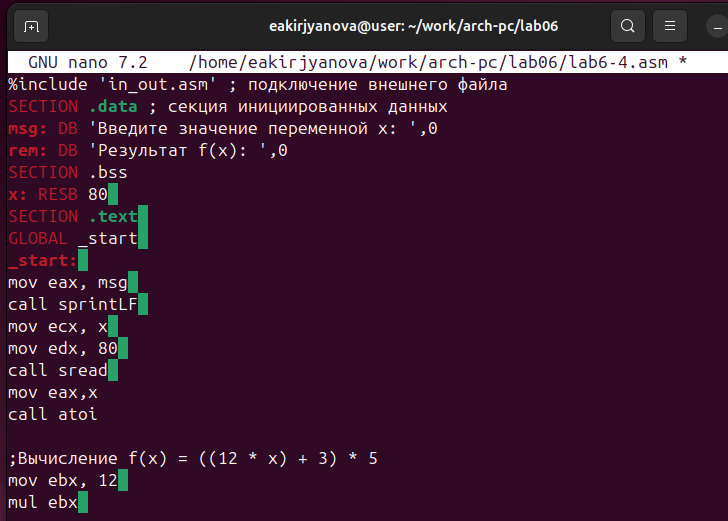{ #fig:022 width=70% }

Создаю исполняемый файл, запускаю и ввожу значения x1, x2 для проверки (рис. [-@fig:023]).

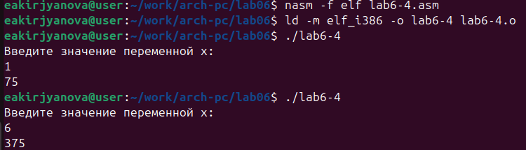{ #fig:023 width=70% }

Текст программы: 

%include 'in_out.asm' 
SECTION .data 
msg: DB 'Введите значение переменной х: ',0
rem: DB 'Результат f(x): ',0
SECTION .bss
x: RESB 80 
SECTION .text 
GLOBAL _start 
_start: 
mov eax, msg 
call sprintLF 
mov ecx, x 
mov edx, 80 
call sread 
mov eax,x
call atoi

;Вычисление f(x) = ((12 * x) + 3) * 5
mov ebx, 12 
mul ebx 
add eax, 3
mov ebx,5 
mul ebx
mov edi,eax
mov eax, edi
call iprintLF
call quit

# Выводы

В ходе выполнения данной лабораторной работы я освоила арифметические инструкции языка ассемблера NASM. 

# Список литературы

1. [Лабораторная работа №6](https://esystem.rudn.ru/pluginfile.php/2089542/mod_resource/content/0/%D0%9B%D0%B0%D0%B1%D0%BE%D1%80%D0%B0%D1%82%D0%BE%D1%80%D0%BD%D0%B0%D1%8F%20%D1%80%D0%B0%D0%B1%D0%BE%D1%82%D0%B0%20%E2%84%966.%20%D0%90%D1%80%D0%B8%D1%84%D0%BC%D0%B5%D1%82%D0%B8%D1%87%D0%B5%D1%81%D0%BA%D0%B8%D0%B5%20%D0%BE%D0%BF%D0%B5%D1%80%D0%B0%D1%86%D0%B8%D0%B8%20%D0%B2%20NASM..pdf)
