---
## Front matter
title: "Отчёт по лабораторной работе №7"
subtitle: "Дисциплина: Архитектура компьютера"
author: "Кирьянова Екатерина Андреевна"

## Generic otions
lang: ru-RU
toc-title: "Содержание"

## Bibliography
bibliography: bib/cite.bib
csl: pandoc/csl/gost-r-7-0-5-2008-numeric.csl

## Pdf output format
toc: true # Table of contents
toc-depth: 2
lof: true # List of figures
fontsize: 12pt
linestretch: 1.5
papersize: a4
documentclass: scrreprt
## I18n polyglossia
polyglossia-lang:
  name: russian
  options:
	- spelling=modern
	- babelshorthands=true
polyglossia-otherlangs:
  name: english
## I18n babel
babel-lang: russian
babel-otherlangs: english
## Fonts
mainfont: IBM Plex Serif
romanfont: IBM Plex Serif
sansfont: IBM Plex Sans
monofont: IBM Plex Mono
mathfont: STIX Two Math
mainfontoptions: Ligatures=Common,Ligatures=TeX,Scale=0.94
romanfontoptions: Ligatures=Common,Ligatures=TeX,Scale=0.94
sansfontoptions: Ligatures=Common,Ligatures=TeX,Scale=MatchLowercase,Scale=0.94
monofontoptions: Scale=MatchLowercase,Scale=0.94,FakeStretch=0.9
mathfontoptions:
## Biblatex
biblatex: true
biblio-style: "gost-numeric"
biblatexoptions:
  - parentracker=true
  - backend=biber
  - hyperref=auto
  - language=auto
  - autolang=other*
  - citestyle=gost-numeric
## Pandoc-crossref LaTeX customization
figureTitle: "Рис."
listingTitle: "Листинг"
lofTitle: "Список иллюстраций"
lolTitle: "Листинги"
## Misc options
indent: true
header-includes:
  - \usepackage{indentfirst}
  - \usepackage{float} # keep figures where there are in the text
  - \floatplacement{figure}{H} # keep figures where there are in the text
---

# Цель работы

Изучить команды условного и безусловного переходов. Приобрести навыки написания
программ с использованием переходов. Познакомиться с назначением и структурой файла
листинга.

# Задание

1. Реализация переходов в NASM
2. Изучение структуры файлов листинга
3. Задание для самостоятельной работы

# Теоретическое введение

Для реализации ветвлений в ассемблере используются так называемые команды передачи
управления или команды перехода. Можно выделить 2 типа переходов:
Условный переход – выполнение или не выполнение перехода в определенную точку
программы в зависимости от проверки условия.
Безусловный переход – выполнение передачи управления в определенную точку программы без каких-либо условий.

Безусловный переход выполняется инструкцией jmp (от англ. jump – прыжок), которая
включает в себя адрес перехода, куда следует передать управление:
jmp <адрес_перехода>
Адрес перехода может быть либо меткой, либо адресом области памяти, в которую предварительно помещен указатель перехода.

Для условного перехода необходима проверка какого-либо условия.
В ассемблере команды условного перехода вычисляют условие перехода анализируя флаги
из регистра флагов.

Флаг – это бит, принимающий значение 1 («флаг установлен»), если выполнено некоторое
условие, и значение 0 («флаг сброшен») в противном случае. Флаги работают независимо
друг от друга, и лишь для удобства они помещены в единый регистр — регистр флагов, отражающий текущее состояние процессора.

Инструкция cmp является одной из инструкций, которая позволяет сравнить операнды и
выставляет флаги в зависимости от результата сравнения.
Инструкция cmp является командой сравнения двух операндов и имеет такой же формат,
как и команда вычитания:
cmp <операнд_1>, <операнд_2>
Команда cmp, так же как и команда вычитания, выполняет вычитание <операнд_2> -
<операнд_1>, но результат вычитания никуда не записывается и единственным результатом
команды сравнения является формирование флагов.

Листинг (в рамках понятийного аппарата NASM) — это один из выходных файлов, создаваемых транслятором. Он имеет текстовый вид и нужен при отладке программы, так как
кроме строк самой программы он содержит дополнительную информацию.
Структура листинга:
номер строки — это номер строки файла листинга (нужно помнить, что номер строки в
файле листинга может не соответствовать номеру строки в файле с исходным текстом
программы);
адрес — это смещение машинного кода от начала текущего сегмента;
машинный код представляет собой ассемблированную исходную строку в виде шестнадцатеричной последовательности. (например, инструкция int 80h начинается по смещению 00000020 в сегменте кода; далее идёт машинный код, в который ассемблируется
инструкция, то есть инструкция int 80h ассемблируется в CD80 (в шестнадцатеричном
представлении); CD80 — это инструкция на машинном языке, вызывающая прерывание
ядра);
исходный текст программы — это просто строка исходной программы вместе с комментариями (некоторые строки на языке ассемблера, например, строки, содержащие
только комментарии, не генерируют никакого машинного кода, и поля «смещение» и
«исходный текст программы» в таких строках отсутствуют, однако номер строки им
присваивается).

# Выполнение лабораторной работы
## Реализация переходов в NASM

Создаю новый каталог и файл в нем (рис. [-@fig:001]).

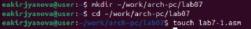{ #fig:001 width=70% }

Ввожу текст программы из листинга 7.1 (рис. [-@fig:002])

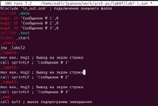{ #fig:002 width=70% }

Транслирую текст программы в объектный файл, выполняю компоновку объектного файла и запускаю исполняемый файл (рис. [-@fig:003]).

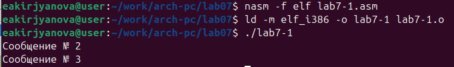{ #fig:003 width=70% }

Изменяю текст программы в соответствии с листингом 7.2 (рис. [-@fig:004]).

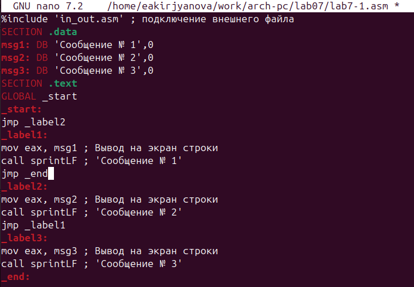{ #fig:004 width=70% }

Создаю обновленный исполняемый файл и запускаю его (рис. [-@fig:005]).

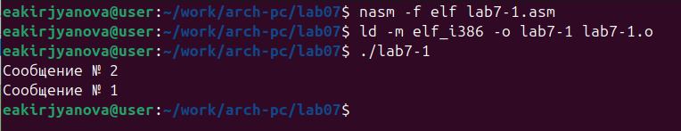{ #fig:005 width=70% }

Меняю текст программы для нужного вывода программы  (рис. [-@fig:006]).

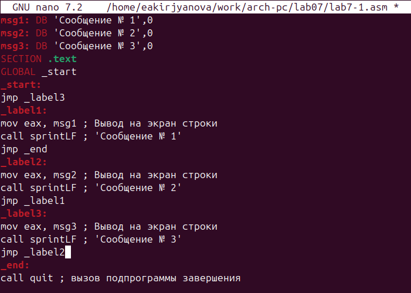{ #fig:006 width=70% }

Транслирую текст программы в объектный файл, выполняю компоновку объектного файла и запускаю исполняемый файл (рис. [-@fig:007]). 

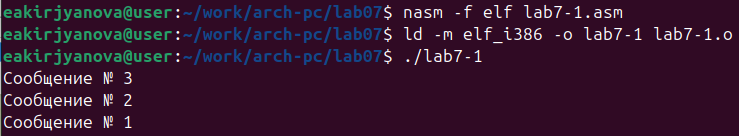{ #fig:007 width=70% }

Создаю новый файл lab7-2.asm (рис. [-@fig:008]).

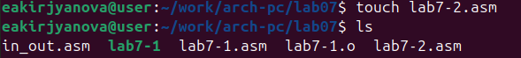{ #fig:008 width=70% }

Ввожу текст программы из листинга 7.3 (рис. [-@fig:009]). 

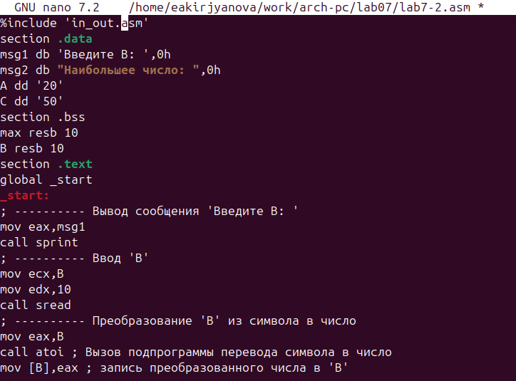{ #fig:009 width=70% }

Создаю исполняемый файл и проверяю его работу для разных значений B (рис. [-@fig:010]).

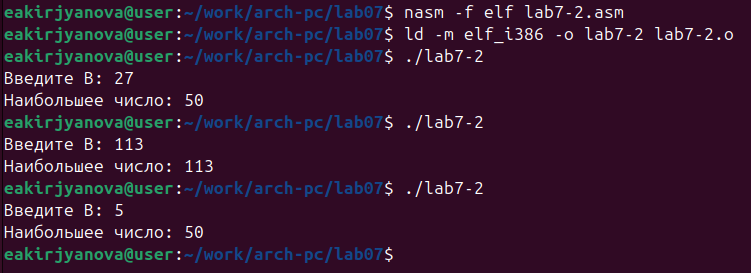{ #fig:010 width=70% }

## Изучение структуры файла листинга

Создаю файл листинга для программы из файла lab7-2.asm (рис. [-@fig:011]).

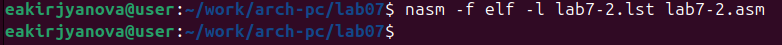{ #fig:011 width=70% }

Открываю файл листинга с помощью mcedit (рис. [-@fig:012]).

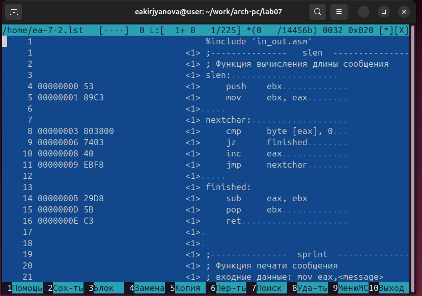{ #fig:012 width=70% }

Строка на 14 месте имеет адрес '0000000B' и машинный код 29D8, sub eax, ebx выполняет вычитание значение ebx из значения eax. Строка на 15 месте имеет адрес '0000000D' и машинный код 5B, pop ebx сохраняет значение в регистре ebx. Строка на 16 месте '0000000E' и машинный код С3, ret используется для возврата из подпрограммы.

Убираю один операнд из двух и трансляция не работает, указывая на отсутствие операнда  (рис. [-@fig:013]).

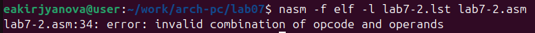{ #fig:013 width=70% }

В листинге отображается ошибка (рис. [-@fig:014]). 

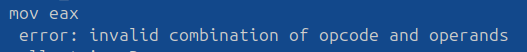{ #fig:014 width=70% }

## Задание для самостоятельной работы

Пишу программу для нахождения наименьшей из 3 целочисленных переменных a, b и c. Значения переменных выбираю согласно 2 варианту (рис. [-@fig:015]).

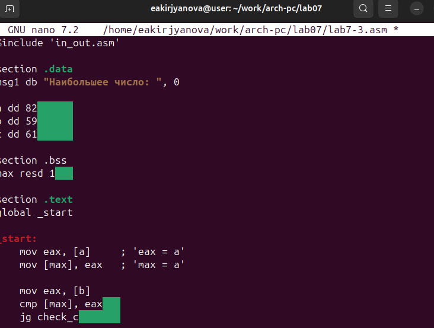{ #fig:015 width=70% }

Создаю исполняемый файл и запускаю. Программа работает корректно (рис. [-@fig:016]).

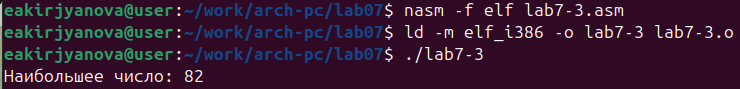{ #fig:016 width=70% }

Пишу программу, которая для введенных с клавиатуры значений x и a вычисляет значение заданной функции f(x) и выводит результат вычислений. Вид функции выбираю из 2 варианта (рис. [-@fig:018]). 

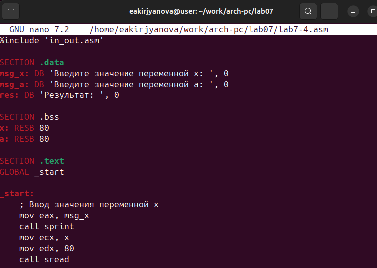{ #fig:018 width=70% }

Создаю исполняемый файл и запускаю. Программа работает корректно (рис. [-@fig:017]).

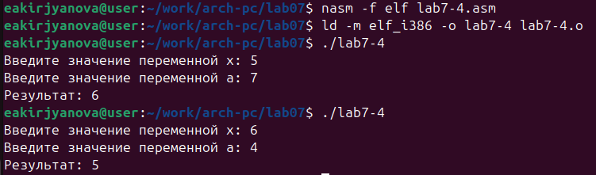{ #fig:017 width=70% }

# Вывод

В ходе выполнения данной лабораторной работы я изучила команды условного и безусловного переходов, приобрела навыки написания программ с использованием переходов и познакомилась с назначением и структурой файла листинга.

# Список литературы

1. [Лабораторная работа №7](https://esystem.rudn.ru/pluginfile.php/2089545/mod_resource/content/0/%D0%9B%D0%B0%D0%B1%D0%BE%D1%80%D0%B0%D1%82%D0%BE%D1%80%D0%BD%D0%B0%D1%8F%20%D1%80%D0%B0%D0%B1%D0%BE%D1%82%D0%B0%20%E2%84%967.%20%D0%9A%D0%BE%D0%BC%D0%B0%D0%BD%D0%B4%D1%8B%20%D0%B1%D0%B5%D0%B7%D1%83%D1%81%D0%BB%D0%BE%D0%B2%D0%BD%D0%BE%D0%B3%D0%BE%20%D0%B8%20%D1%83%D1%81%D0%BB%D0%BE%D0%B2%D0%BD%D0%BE%D0%B3%D0%BE%20%D0%BF%D0%B5%D1%80%D0%B5%D1%85%D0%BE%D0%B4%D0%BE%D0%B2%20%D0%B2%20Nasm.%20%D0%9F%D1%80%D0%BE%D0%B3%D1%80%D0%B0%D0%BC%D0%BC%D0%B8%D1%80%D0%BE%D0%B2%D0%B0%D0%BD%D0%B8%D0%B5%20%D0%B2%D0%B5%D1%82%D0%B2%D0%BB%D0%B5%D0%BD%D0%B8%D0%B9..pdf)
