---
## Front matter
title: "Отчёт по лабораторной работе №8"
subtitle: "Дисциплина: Архитектура компьютера"
author: "Кирьянова Екатерина Андреевна"

## Generic otions
lang: ru-RU
toc-title: "Содержание"

## Bibliography
bibliography: bib/cite.bib
csl: pandoc/csl/gost-r-7-0-5-2008-numeric.csl

## Pdf output format
toc: true # Table of contents
toc-depth: 2
lof: true # List of figures
fontsize: 12pt
linestretch: 1.5
papersize: a4
documentclass: scrreprt
## I18n polyglossia
polyglossia-lang:
  name: russian
  options:
	- spelling=modern
	- babelshorthands=true
polyglossia-otherlangs:
  name: english
## I18n babel
babel-lang: russian
babel-otherlangs: english
## Fonts
mainfont: IBM Plex Serif
romanfont: IBM Plex Serif
sansfont: IBM Plex Sans
monofont: IBM Plex Mono
mathfont: STIX Two Math
mainfontoptions: Ligatures=Common,Ligatures=TeX,Scale=0.94
romanfontoptions: Ligatures=Common,Ligatures=TeX,Scale=0.94
sansfontoptions: Ligatures=Common,Ligatures=TeX,Scale=MatchLowercase,Scale=0.94
monofontoptions: Scale=MatchLowercase,Scale=0.94,FakeStretch=0.9
mathfontoptions:
## Biblatex
biblatex: true
biblio-style: "gost-numeric"
biblatexoptions:
  - parentracker=true
  - backend=biber
  - hyperref=auto
  - language=auto
  - autolang=other*
  - citestyle=gost-numeric
## Pandoc-crossref LaTeX customization
figureTitle: "Рис."
listingTitle: "Листинг"
lofTitle: "Список иллюстраций"
lolTitle: "Листинги"
## Misc options
indent: true
header-includes:
  - \usepackage{indentfirst}
  - \usepackage{float} # keep figures where there are in the text
  - \floatplacement{figure}{H} # keep figures where there are in the text
---

# Цель работы

Приобрести навыки написания программ с использованием циклов и обработкой
аргументов командной строки.

# Задание

1. Реализация циклов в NASM
2. Обработка аргументов командной строки
3. Задание для самостоятельной работы

# Теоретическое введение

Стек — это структура данных, организованная по принципу LIFO («Last In — First Out»
или «последним пришёл — первым ушёл»). Стек является частью архитектуры процессора и
реализован на аппаратном уровне. Для работы со стеком в процессоре есть специальные
регистры (ss, bp, sp) и команды.
Основной функцией стека является функция сохранения адресов возврата и передачи
аргументов при вызове процедур. Кроме того, в нём выделяется память для локальных
переменных и могут временно храниться значения регистров.
На рис. 8.1 показана схема организации стека в процессоре.
Стек имеет вершину, адрес последнего добавленного элемента, который хранится в регистре esp (указатель стека). Противоположный конец стека называется дном. Значение,
помещённое в стек последним, извлекается первым. При помещении значения в стек указатель стека уменьшается, а при извлечении — увеличивается.
Команда pop извлекает значение из стека, т.е. извлекает значение из ячейки памяти, на
которую указывает регистр esp, после этого уменьшает значение регистра esp на 4. У этой
команды также один операнд, который может быть регистром или переменной в памяти.
Для организации циклов существуют специальные инструкции. Для всех инструкций
максимальное количество проходов задаётся в регистре ecx. Наиболее простой является инструкция loop.
Иструкция loop выполняется в два этапа. Сначала из регистра ecx вычитается единица и
его значение сравнивается с нулём. Если регистр не равен нулю, то выполняется переход к
указанной метке. Иначе переход не выполняется и управление передаётся команде, которая
следует сразу после команды loop.

# Выполнение лабораторной работы
## Реализация циклов в NASM

Создаю новый каталог и файл в нем (рис. [-@fig:001]).

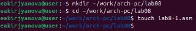{ #fig:001 width=70% }

Ввожу текст программы из листинга 8.1 (рис. [-@fig:002])

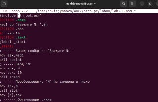{ #fig:002 width=70% }

Транслирую текст программы в объектный файл, выполняю компоновку объектного файла и запускаю исполняемый файл (рис. [-@fig:003]).

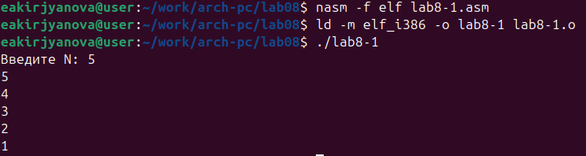{ #fig:003 width=70% }

Меняю текст программы, добавив изменение значения регистра ecx в цикле (рис. [-@fig:004]).

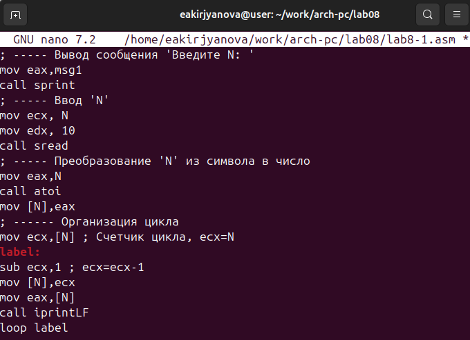{ #fig:004 width=70% }

Создаю обновленный исполняемый файл и запускаю его. Цикл закольцевался и стал бесконечным (рис. [-@fig:005]).

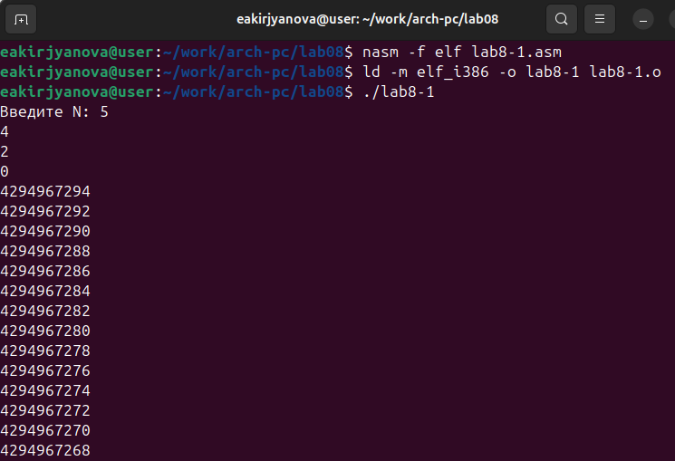{ #fig:005 width=70% }

Вношу изменения в текст программы, добавив команды push и pop  (рис. [-@fig:006]).

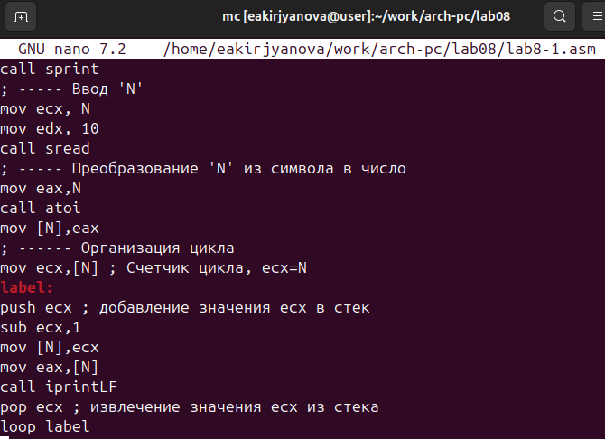{ #fig:006 width=70% }

Транслирую текст программы в объектный файл, выполняю компоновку объектного файла и запускаю исполняемый файл. Число проходов цикла стало соответствовать числу, введенному с клавиатуры (рис. [-@fig:007]). 

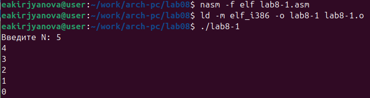{ #fig:007 width=70% }

## Обработка аргументов командной строки

Создаю новый файл lab8-2.asm (рис. [-@fig:008]).

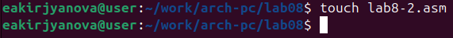{ #fig:008 width=70% }

Ввожу текст программы из листинга 8.2 (рис. [-@fig:009]). 

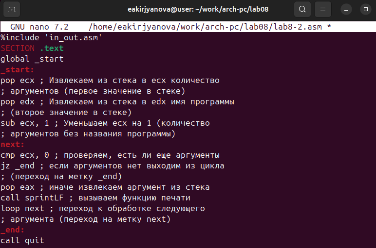{ #fig:009 width=70% }

Создаю исполняемый файл и запускаю, указав аргументы. Программа выводит 3 аргумента в разных видах (рис. [-@fig:010]).

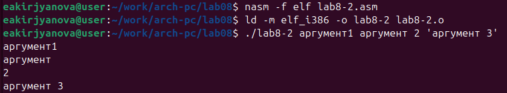{ #fig:010 width=70% }

Создаю файл lab8-3.asm (рис. [-@fig:011]).

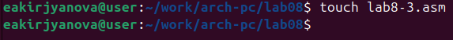{ #fig:011 width=70% }

Ввожу текст программы из листинга 8.3 (рис. [-@fig:012]).

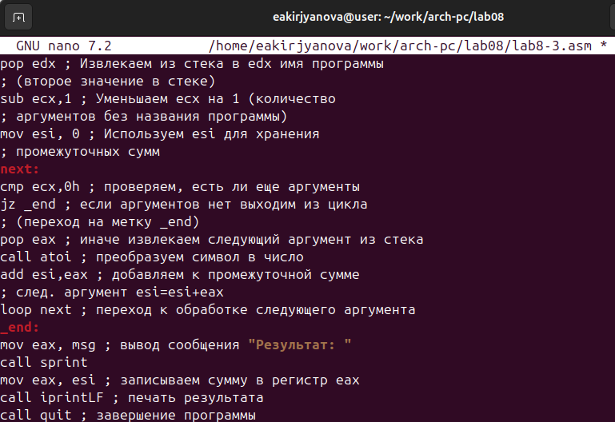{ #fig:012 width=70% }

Создаю исполняемый файл и запускаю его, указав аргументы (рис. [-@fig:013]).

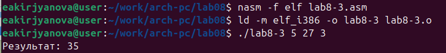{ #fig:013 width=70% }

Изменяю текст программы для вычисления произведения (рис. [-@fig:014]). 

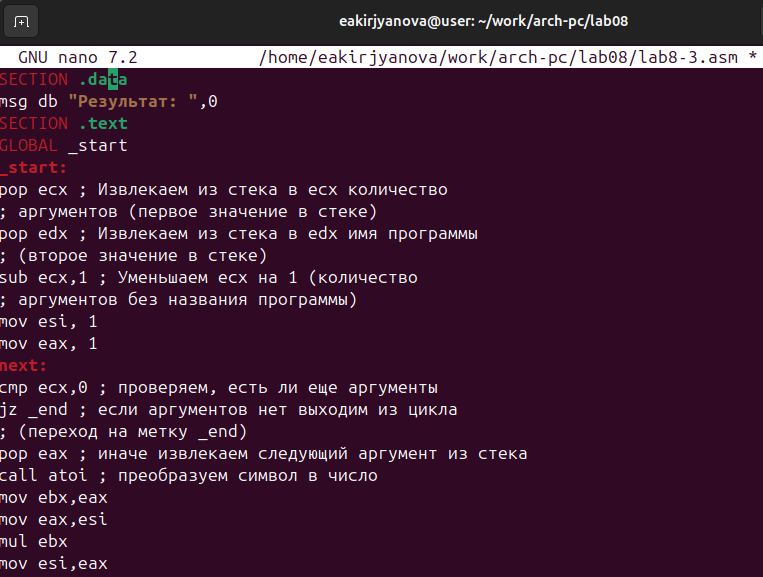{ #fig:014 width=70% }

Создаю исполняемый файл и запускаю его (рис. [-@fig:015]).

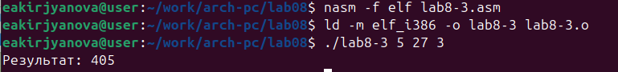{ #fig:015 width=70% }

## Задание для самостоятельной работы

Создаю новый файл lab8-4.asm (рис. [-@fig:016]).

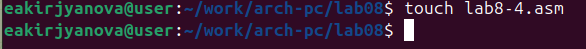{ #fig:016 width=70% }

Пишу программу, которая находит сумму значений функций. Вид функции выбираю согласно 2 варианту (рис. [-@fig:017]). 

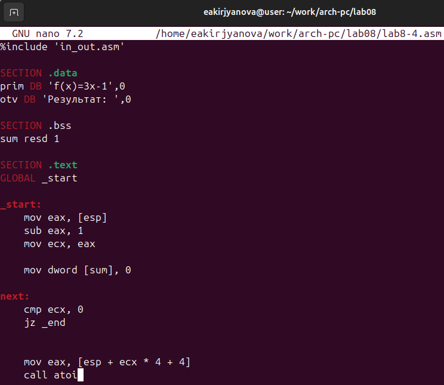{ #fig:017 width=70% }

Создаю исполняемый файл и запускаю. Программа работает корректно (рис. [-@fig:018]).

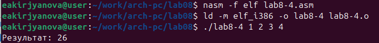{ #fig:018 width=70% }

# Вывод

В ходе выполнения данной лабораторной работы я приобрелв навыки написания программ с использованием циклов и обработкой аргументов командной строки.

# Список литературы

1. [Лабораторная работа №8](https://esystem.rudn.ru/pluginfile.php/2089548/mod_resource/content/0/%D0%9B%D0%B0%D0%B1%D0%BE%D1%80%D0%B0%D1%82%D0%BE%D1%80%D0%BD%D0%B0%D1%8F%20%D1%80%D0%B0%D0%B1%D0%BE%D1%82%D0%B0%20%E2%84%968.%20%D0%9F%D1%80%D0%BE%D0%B3%D1%80%D0%B0%D0%BC%D0%BC%D0%B8%D1%80%D0%BE%D0%B2%D0%B0%D0%BD%D0%B8%D0%B5%20%D1%86%D0%B8%D0%BA%D0%BB%D0%B0.%20%D0%9E%D0%B1%D1%80%D0%B0%D0%B1%D0%BE%D1%82%D0%BA%D0%B0%20%D0%B0%D1%80%D0%B3%D1%83%D0%BC%D0%B5%D0%BD%D1%82%D0%BE%D0%B2%20%D0%BA%D0%BE%D0%BC%D0%B0%D0%BD%D0%B4%D0%BD%D0%BE%D0%B9%20%D1%81%D1%82%D1%80%D0%BE%D0%BA%D0%B8..pdf)
