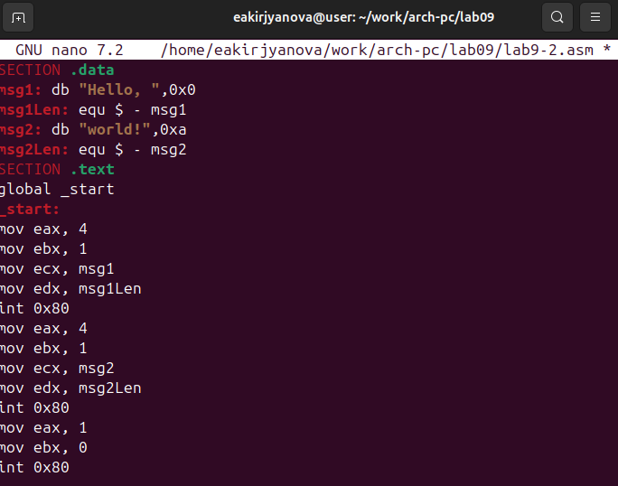
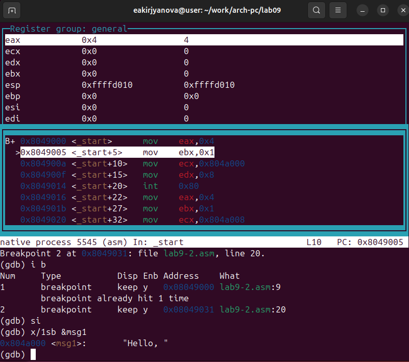
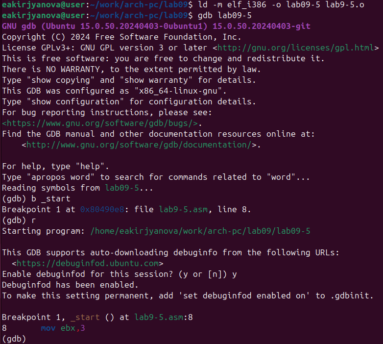
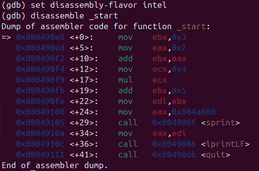

---
## Front matter
title: "Отчёт по лабораторной работе №9"
subtitle: "Дисциплина: Архитектура компьютера"
author: "Кирьянова Екатерина Андреевна"

## Generic otions
lang: ru-RU
toc-title: "Содержание"

## Bibliography
bibliography: bib/cite.bib
csl: pandoc/csl/gost-r-7-0-5-2008-numeric.csl

## Pdf output format
toc: true # Table of contents
toc-depth: 2
lof: true # List of figures
fontsize: 12pt
linestretch: 1.5
papersize: a4
documentclass: scrreprt
## I18n polyglossia
polyglossia-lang:
  name: russian
  options:
	- spelling=modern
	- babelshorthands=true
polyglossia-otherlangs:
  name: english
## I18n babel
babel-lang: russian
babel-otherlangs: english
## Fonts
mainfont: IBM Plex Serif
romanfont: IBM Plex Serif
sansfont: IBM Plex Sans
monofont: IBM Plex Mono
mathfont: STIX Two Math
mainfontoptions: Ligatures=Common,Ligatures=TeX,Scale=0.94
romanfontoptions: Ligatures=Common,Ligatures=TeX,Scale=0.94
sansfontoptions: Ligatures=Common,Ligatures=TeX,Scale=MatchLowercase,Scale=0.94
monofontoptions: Scale=MatchLowercase,Scale=0.94,FakeStretch=0.9
mathfontoptions:
## Biblatex
biblatex: true
biblio-style: "gost-numeric"
biblatexoptions:
  - parentracker=true
  - backend=biber
  - hyperref=auto
  - language=auto
  - autolang=other*
  - citestyle=gost-numeric
## Pandoc-crossref LaTeX customization
figureTitle: "Рис."
tableTitle: "Таблица"
listingTitle: "Листинг"
lofTitle: "Список иллюстраций"
lolTitle: "Листинги"
## Misc options
indent: true
header-includes:
  - \usepackage{indentfirst}
  - \usepackage{float} # keep figures where there are in the text
  - \floatplacement{figure}{H} # keep figures where there are in the text
---

# Цель работы

Приобретение навыков написания программ с использованием подпрограмм.
Знакомство с методами отладки при помощи GDB и его основными возможностями

# Задание 

1. Реализация подпрограмм в NASM
2. Отладка программам с помощью GDB
3. Задание для самостоятельной работы 

# Теоретическое введение 

Отладка — это процесс поиска и исправления ошибок в программе. В общем случае его
можно разделить на четыре этапа:
обнаружение ошибки;
поиск её местонахождения;
определение причины ошибки;
исправление ошибки.
Можно выделить следующие типы ошибок:
синтаксические ошибки — обнаруживаются во время трансляции исходного кода и
вызваны нарушением ожидаемой формы или структуры языка;
семантические ошибки — являются логическими и приводят к тому, что программа
запускается, отрабатывает, но не даёт желаемого результата;
ошибки в процессе выполнения — не обнаруживаются при трансляции и вызывают прерывание выполнения программы (например, это ошибки, связанные с переполнением
или делением на ноль).
Второй этап — поиск местонахождения ошибки. Некоторые ошибки обнаружить довольно трудно. Лучший способ найти место в программе, где находится ошибка, это разбить
программу на части и произвести их отладку отдельно друг от друга.
Третий этап — выяснение причины ошибки. После определения местонахождения ошибки
обычно проще определить причину неправильной работы программы.
Последний этап — исправление ошибки. После этого при повторном запуске программы,
может обнаружиться следующая ошибка, и процесс отладки начнётся заново.
Наиболее часто применяют следующие методы отладки:
создание точек контроля значений на входе и выходе участка программы (например,
вывод промежуточных значений на экран — так называемые диагностические сообщения);
использование специальных программ-отладчиков.
Отладчики позволяют управлять ходом выполнения программы, контролировать и изменять данные. Это помогает быстрее найти место ошибки в программе и ускорить её
исправление. Наиболее популярные способы работы с отладчиком — это использование
точек останова и выполнение программы по шагам.
Пошаговое выполнение — это выполнение программы с остановкой после каждой строчки,
чтобы программист мог проверить значения переменных и выполнить другие действия.
Точки останова — это специально отмеченные места в программе, в которых программаотладчик приостанавливает выполнение программы и ждёт команд.
GDB (GNU Debugger — отладчик проекта GNU) работает на многих UNIX-подобных
системах и умеет производить отладку многих языков программирования. GDB предлагает
обширные средства для слежения и контроля за выполнением компьютерных программ. Отладчик не содержит собственного графического пользовательского интерфейса и использует
стандартный текстовый интерфейс консоли. Однако для GDB существует несколько сторонних графических надстроек, а кроме того, некоторые интегрированные среды разработки
используют его в качестве базовой подсистемы отладки.

# Выполнение лабораторной работы

## Реализация подпрограмм в NASM

Создаю каталог lab09 и файл lab9-1.asm (рис. [-@fig:001]).

{ #fig:001 width=70% }

Ввожу текст листинга в файл (рис. [-@fig:002]) и запускаю программу (рис. [-@fig:003]).

{ #fig:002 width=70% }

{ #fig:003 width=70% }

Меняю текст программы (рис. [-@fig:004]), чтобы она решала выражение f(g(x)) (рис. [-@fig:005]).

{ #fig:004 width=70% }

{ #fig:005 width=70% }

## Отладка программам с помощью GDB

Создаю файл lab9-2.asm и ввожу туда программу (рис. [-@fig:006]).

{ #fig:006 width=70% }

Запускаю файл второй программы в отладчик gdb (рис. [-@fig:007]).

{ #fig:007 width=70% }

Ставлю брекпоинт на метку _start и запускаю программу (рис. [-@fig:008]).

{ #fig:008 width=70% }

Просматриваю дисассимплированный код программы начиная с метки (рис. [-@fig:009]).

{ #fig:009 width=70% }

С помощью команды переключаюсь на intel'овское отображение синтаксиса (рис. [-@fig:010]). Отличие заключается в командах, в диссамилированном отображении в командах используют % и $, а в Intel отображение эти символы не используются. На такое отображение удобнее смотреть.

{ #fig:010 width=70% }

Включаю режим псевдографики (рис. [-@fig:011]).

{ #fig:011 width=70% }

Смотрю наличие меток и добавляю еще одну метку на предпоследнюю инструкцию (рис. [-@fig:012]).

{ #fig:012 width=70% }

С помощью команды si смотрю регистры (рис. [-@fig:013]).

{ #fig:013 width=70% }

С помощью команды я смотрю значение переменной msg1 (рис. [-@fig:014]).

{ #fig:014 width=70% }

Смотрю значение второй переменной msg2 (рис. [-@fig:015]).

{ #fig:015 width=70% }

С помощью команды set меняю значение переменной msg1 (рис. [-@fig:016]).

{ #fig:016 width=70% }

Меняю переменную msg2 (рис. [-@fig:017]).

{ #fig:017 width=70% }

Вывожу значение регистров ecx и eax (рис. [-@fig:018]).

{ #fig:018 width=70% }

Меняю значение регистра ebx. Команда выводит два разных значения так как в первый раз мы вносим значение 2, а во второй раз регистр равен двум, поэтому и значения разные (рис. [-@fig:019]).

{ #fig:019 width=70% }

Копирую файл lab8-2.asm и переименовываю его (рис. [-@fig:020]). Запуcкаю файл в отладчике, указав аргументы (рис. [-@fig:021]).

{ #fig:020 width=70% }

{ #fig:021 width=70% }

Ставлю метку на _start и запускаю файл (рис. [-@fig:022]).

{ #fig:022 width=70% }

Проверяю адрес вершины стека и убеждаюсь, что там хранится 5 элементов (рис. [-@fig:023]).

{ #fig:023 width=70% }

Смотрю все позиции стека. По первому адрему хранится адрес, в остальных адресах хранятся элементы. Элементы расположены с интервалом в 4 единицы, так как стек может хранить до 4 байт, и для того чтобы данные сохранялись нормально и без помех, компьютер использует новый стек для новой информации (рис. [-@fig:024]).

{ #fig:024 width=70% }

## Задание для самостоятельной работы

Преобразовываю программу из лабораторной работы №8 (рис. [-@fig:025]) и реализую вычисления как подпрограмму (рис. [-@fig:026]).

{ #fig:025 width=70% }

{ #fig:026 width=70% }

Переписываю программу (рис. [-@fig:027]) и пробую запустить ее чтобы увидеть ошибку. Ошибка арифметическая (рис. [-@fig:028]).

{ #fig:027 width=70% }

{ #fig:028 width=70% }

После появления ошибки, запускаю программу в отладчике (рис. [-@fig:029]).

{ #fig:029 width=70% }

{ #fig:030 width=70% }

Открываю регистры и анализирую их. Некоторые регистры стоят не на своих местах, исправляю это (рис. [-@fig:031]).

{ #fig:031 width=70% }

Меняю регистры и запускаю программу, программа работает корректно (рис. [-@fig:032]).

{ #fig:032 width=70% }

# Вывод

В ходе выполнения данной лабораторной работы я приобрела навыки написания программ использованием подпрограмм. Познакомилась с методами отладки при помозь GDB и его основными возможностями.

# Список литературы

1. [Лабораторная работа №9](https://esystem.rudn.ru/pluginfile.php/2089551/mod_resource/content/0/%D0%9B%D0%B0%D0%B1%D0%BE%D1%80%D0%B0%D1%82%D0%BE%D1%80%D0%BD%D0%B0%D1%8F%20%D1%80%D0%B0%D0%B1%D0%BE%D1%82%D0%B0%20%E2%84%969.%20%D0%9F%D0%BE%D0%BD%D1%8F%D1%82%D0%B8%D0%B5%20%D0%BF%D0%BE%D0%B4%D0%BF%D1%80%D0%BE%D0%B3%D1%80%D0%B0%D0%BC%D0%BC%D1%8B.%20%D0%9E%D1%82%D0%BB%D0%B0%D0%B4%D1%87%D0%B8%D0%BA%20..pdf)
