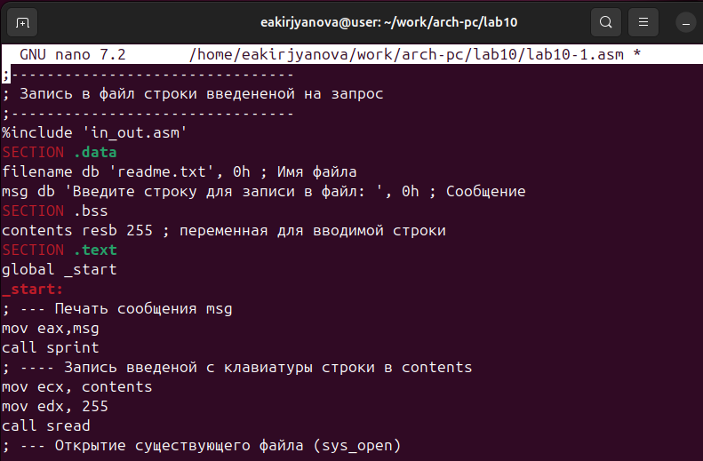

---
## Front matter
title: "Отчёт по лабораторной работе №10"
subtitle: "Дисциплина: Архитектура компьютера"
author: "Кирьянова Екатерина Андреевна"

## Generic otions
lang: ru-RU
toc-title: "Содержание"

## Bibliography
bibliography: bib/cite.bib
csl: pandoc/csl/gost-r-7-0-5-2008-numeric.csl

## Pdf output format
toc: true # Table of contents
toc-depth: 2
lof: true # List of figures
fontsize: 12pt
linestretch: 1.5
papersize: a4
documentclass: scrreprt
## I18n polyglossia
polyglossia-lang:
  name: russian
  options:
	- spelling=modern
	- babelshorthands=true
polyglossia-otherlangs:
  name: english
## I18n babel
babel-lang: russian
babel-otherlangs: english
## Fonts
mainfont: IBM Plex Serif
romanfont: IBM Plex Serif
sansfont: IBM Plex Sans
monofont: IBM Plex Mono
mathfont: STIX Two Math
mainfontoptions: Ligatures=Common,Ligatures=TeX,Scale=0.94
romanfontoptions: Ligatures=Common,Ligatures=TeX,Scale=0.94
sansfontoptions: Ligatures=Common,Ligatures=TeX,Scale=MatchLowercase,Scale=0.94
monofontoptions: Scale=MatchLowercase,Scale=0.94,FakeStretch=0.9
mathfontoptions:
## Biblatex
biblatex: true
biblio-style: "gost-numeric"
biblatexoptions:
  - parentracker=true
  - backend=biber
  - hyperref=auto
  - language=auto
  - autolang=other*
  - citestyle=gost-numeric
## Pandoc-crossref LaTeX customization
figureTitle: "Рис."
listingTitle: "Листинг"
lofTitle: "Список иллюстраций"
lolTitle: "Листинги"
## Misc options
indent: true
header-includes:
  - \usepackage{indentfirst}
  - \usepackage{float} # keep figures where there are in the text
  - \floatplacement{figure}{H} # keep figures where there are in the text
---

# Цель работы

Приобретение навыков написания программ для работы с файлами

# Задание 

1. Изменение прав доступа
2. Задание для самостоятельной работы

# Выполнение лабораторной работы

## Изменение прав доступа

Создаю каталог lab10 и в нем файл lab10.asm (рис. [-@fig:001]).

{ #fig:001 width=70% }

Ввожу в файл текст программы и запускаю ее (рис. [-@fig:002]). Ответ сохранился в файле readme.txt (рис. [-@fig:003]).

{ #fig:002 width=70% }

{ #fig:003 width=70% }

С помощью команды сhmod запрещаю выполнять программу. Выдало отказ в доступе,так как я запретила запускать программу для владельца (рис. [-@fig:004]).

{ #fig:004 width=70% }

С помощью команды я дал разрешение на исполнение файлу с исходным текстом, и она выполнилась (рис. [-@fig:005]).

{ #fig:005 width=70% }

В соответствии с вариантом 2 предоставляю права доступа к файлу readme-1.txt в символьном виде (рис. [-@fig:006]), а для файла readme-2.txt в двоичном виде (рис. [-@fig:007]).

{ #fig:006 width=70% }

{ #fig:007 width=70% }

## Задание для самостоятельной работы

Пишу программу, которая запрашивает имя, выводит его в созданном файле (рис. [-@fig:008]).

{ #fig:008 width=70% }

Запускаю программу (рис. [-@fig:009]).

{ #fig:009 width=70% }

# Вывод

В ходе выполнения данной лабораторной работы я приобрела навыки написания программ для работы с файлами.

# Список литературы

1. [Лабораторная работа №10](https://esystem.rudn.ru/pluginfile.php/2089554/mod_resource/content/0/%D0%9B%D0%B0%D0%B1%D0%BE%D1%80%D0%B0%D1%82%D0%BE%D1%80%D0%BD%D0%B0%D1%8F%20%D1%80%D0%B0%D0%B1%D0%BE%D1%82%D0%B0%20%E2%84%9610.%20%D0%A0%D0%B0%D0%B1%D0%BE%D1%82%D0%B0%20%D1%81%20%D1%84%D0%B0%D0%B9%D0%BB%D0%B0%D0%BC%D0%B8%20%D1%81%D1%80%D0%B5%D0%B4%D1%81%D1%82%D0%B2%D0%B0%D0%BC%D0%B8%20Nasm.pdf)
